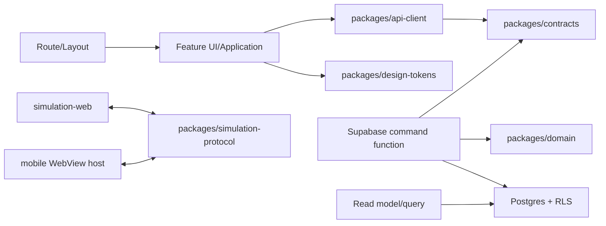

# BioLearn V2 - Cấu trúc repository và chiến lược triển khai

- **Trạng thái:** Kiến trúc mục tiêu, bắt buộc áp dụng cho BioLearn V2
- **Nhánh khởi tạo:** `biolearn-v2-foundation`
- **Cập nhật:** 2026-08-12

Tài liệu này cụ thể hóa cấu trúc trong
`docs/BIOLEARN_V2_SYSTEM_BLUEPRINT.md`. Blueprint quyết định kiến trúc và thứ
tự triển khai; tài liệu này quyết định code, test, migration, asset và cấu hình
phải nằm ở đâu. Không được tạo thư mục rỗng hàng loạt. Chỉ tạo đường dẫn khi có
hạng mục roadmap đã được duyệt và có code hoặc tài liệu thực sự thuộc về nó.

## 1. Kết luận phản biện

Hệ thống cũ có đủ nhiều ý tưởng sản phẩm nhưng đang gom route, state, truy cập
dữ liệu và nghiệp vụ vào một ứng dụng React. Nếu tiếp tục thêm mobile, Map,
Mini Boss, thực hành, quiz live và PvP ngay trên cấu trúc này thì lỗi sẽ lan giữa
các chức năng và rất khó kiểm tra reward/progress.

Hướng V2 phải giữ **parity nghiệp vụ**, không giữ sự lộn xộn của code cũ:

- Giữ BioLearn, các vai trò học sinh/giáo viên/admin và toàn bộ nhóm chức năng
  đã có làm danh mục đối soát.
- Xây V2 trên root branch độc lập; legacy ở `democode`/`main` chỉ maintenance và
  là nguồn tham khảo hành vi.
- Dùng modular monolith trên Supabase/Postgres; chưa tách microservice.
- Bắt đầu Expo từ giai đoạn foundation, nhưng backend contract và luật nghiệp
  vụ phải được khóa trước khi nối màn hình thật.
- Mỗi thay đổi phải có một domain sở hữu rõ ràng; không tạo thêm các vùng
  `common`, `misc`, `helpers` hay file cấu hình ở root chỉ vì tiện trước mắt.

## 2. Cây repository chuẩn

```text
NextGen/
  apps/
    mobile/                         # Expo + Expo Router, ứng dụng học sinh
      app/                          # Route/layout mỏng, không chứa nghiệp vụ
      src/
        bootstrap/                  # Khởi tạo app, providers, error boundary
        features/                   # UI/application code theo domain
        platform/                   # storage, network, notifications, WebView
        ui/                         # primitive/composition dùng trong mobile
      assets/                       # Asset đóng gói riêng cho mobile
      app.config.ts
      eas.json

    teacher-web/                    # Lớp học, giao bài, báo cáo, quiz live
      src/
        app/                        # Router, providers, shell
        features/
        ui/

    admin-web/                      # User, role, audit, moderation, vận hành
      src/
        app/
        features/
        ui/

    content-studio/                 # Biên soạn, sourceRefs, review, publish
      src/
        app/
        features/
        ui/

    simulation-web/                 # Runtime 3D/web chuyên biệt cho WebView
      src/
        app/
        simulations/
        bridge/

  packages/
    domain/                         # Nghiệp vụ thuần TypeScript
      src/
        identity/
        curriculum/
        journey/
        activity/
        economy/
        engagement/
        competition/
        classroom/
        quiz-live/
        media/
        operations/

    contracts/                      # DTO/schema runtime cho command/query/event
      src/
        commands/
        queries/
        events/
        errors/

    api-client/                     # Typed client, auth session, retry, mapping lỗi
    curriculum/                     # Schema nội dung, sourceRefs, validator
    design-tokens/                  # Light/dark tokens, type, spacing, motion, glass
    simulation-protocol/            # Message schema native <-> simulation WebView
    test-fixtures/                  # Fixture giả lập, tuyệt đối không lấy production
    tooling/                        # ESLint, TypeScript, test config dùng chung

  supabase/
    migrations/                     # Nguồn sự thật duy nhất của schema V2
    functions/                      # Command handler theo use case
    seed/                           # Chỉ local/staging, fail-closed với production
    tests/                          # RLS, pgTAP, integration và contract test

  docs/
    adr/                            # Quyết định kiến trúc, có trạng thái/hậu quả
    workflows/                      # Luồng nghiệp vụ và sequence diagram
    runbooks/                       # Deploy, rollback, incident, data repair
    assets/                         # Ảnh tham chiếu thiết kế, không phải asset runtime

  documents/
    README.md                       # Quy tắc tài liệu local; source/ bị Git ignore
```

Không được merge/copy toàn bộ `src/`, `public/`, SQL hoặc config từ nhánh legacy
vào V2. Mỗi hành vi/asset cần tái sử dụng phải có inventory, owner, quyền sử dụng,
contract và kiểm tra riêng. `apps/legacy-web` chỉ được tạo nếu một ADR sau này
chứng minh cần thiết; mặc định legacy vẫn nằm ngoài snapshot V2.

## 3. Cấu trúc một feature

Chỉ tạo thư mục con thật sự cần dùng. Mẫu đầy đủ của một feature trong app:

```text
features/journey/
  api/                  # Gọi typed api-client và map DTO
  application/          # Điều phối query/command ở phía app
  components/           # UI chỉ thuộc Journey
  hooks/                # Hook chỉ thuộc Journey
  model/                # View model/state cục bộ, không phải entity backend
  screens/              # Màn hình compose feature
  tests/                # Integration/component tests của feature
  index.ts              # Public API nhỏ, không export nội bộ tràn lan
```

Quy tắc phụ thuộc:



- Route chỉ parse tham số, kiểm tra quyền ở mức điều hướng và compose screen.
- Screen/component không import `@supabase/supabase-js`, tên bảng, RPC hoặc SQL.
- `packages/domain` không import React, Expo, browser API, Supabase SDK hoặc UI.
- Package không được import ngược từ `apps/*`.
- Code dùng chung chỉ vào `packages/*` khi có contract ổn định hoặc được từ hai
  app sử dụng; không đưa code một màn hình vào package để “dùng sau”.
- Backend là nơi quyết định reward, progress, streak, role, publish, score và
  kết quả PvP. Client chỉ gửi intent và evidence.

## 4. Ánh xạ chức năng cũ sang V2

| Chức năng/route legacy | Domain sở hữu | Vị trí đích | Cách xử lý |
|---|---|---|---|
| `/login`, `/register`, profile | Identity & Access | `apps/mobile/src/features/identity`, `packages/domain/src/identity` | Viết flow session/role mới; không port hook cũ nguyên khối |
| `/home`, chuỗi ngày | Engagement | `features/engagement` | Server time, timezone policy và idempotency |
| `/class-select`, `/map/:classId` | Curriculum + Journey | `features/journey`, `packages/curriculum` | Map theo lớp/chương, node từ dữ liệu đã publish |
| `/play/...`, bài học | Activity | `features/activity` | Renderer theo activity contract, không hard-code trong screen |
| `/minigame/:classId` | Activity | `features/activity/games` | Chỉ giữ game đạt mục tiêu học tập và có rubric |
| `/boss/...` | Activity encounter | `features/activity/encounters` | Tách Mini Boss/Boss; có state machine và evidence |
| Thực hành trong bài | Activity lab | `features/activity/labs` | Quy trình thao tác, quan sát, số liệu, phân tích; không biến thành quiz |
| XP, coin, energy | Economy | `features/economy`, reward ledger backend | Một transaction server-authoritative cho mỗi completion key |
| `/missions` | Engagement | `features/engagement/missions` | Claim qua command idempotent |
| `/leaderboard` | Competition | `features/competition/leaderboard` | Snapshot/season từ backend, không tính thứ hạng trên client |
| `/battle`, `/battle-pvp` | Competition | `features/competition/pvp` | Matchmaking, reconnect, anti-cheat và server authority |
| `/quiz-room`, teacher quiz | Quiz Live + Classroom | mobile participant + `apps/teacher-web` | Room state machine, không lộ đáp án trước khi khóa câu |
| `/simulations` | Activity + Media | mobile catalog + simulation runtime | 2D native ưu tiên; asset có version/license |
| `/biology3d` và game 3D | Media/Simulation | `apps/simulation-web`, protocol bridge | Dùng WebView có message schema ở giai đoạn đầu |
| tài liệu và video | Media | mobile media feature + object storage metadata | Không commit/phát hành nội dung chưa rõ quyền |
| `/teacher` | Classroom | `apps/teacher-web` | RBAC/RLS theo trường/lớp, audit thao tác quan trọng |
| `/admin/*` | Operations | `apps/admin-web` | Role server-side, audit log, không có nút sửa dữ liệu âm thầm |
| biên soạn bài/câu hỏi | Curriculum | `apps/content-studio` | Draft -> review -> approved -> published theo version |
| Chat AI cũ | Tính năng hỗ trợ, chưa phải core | ADR riêng sau vertical slice | Không đưa API key/model call trực tiếp vào mobile |

Mỗi chức năng legacy chỉ được đánh dấu parity khi đã có: contract, quyền truy
cập, loading/empty/error/offline state, test, telemetry tối thiểu và kết quả đối
chiếu nghiệp vụ. “Có màn hình giống” không đồng nghĩa với parity.

## 5. Quy tắc đặt file và đặt tên

| Loại thay đổi | Nơi được phép | Không được đặt |
|---|---|---|
| Mobile screen | `apps/mobile/src/features/<domain>/screens` | root `screens/`, `packages/domain` |
| UI dùng riêng app | `apps/<app>/src/ui` hoặc feature `components` | `packages/design-tokens` |
| Token/theme | `packages/design-tokens` | màu rải trong JSX, file CSS ngẫu nhiên ở root |
| DTO/schema API | `packages/contracts` | component, hook, file migration |
| Luật nghiệp vụ thuần | `packages/domain/src/<domain>` | route, screen, Supabase client |
| Command có ghi dữ liệu | `supabase/functions/<command-name>` | client hoặc query helper |
| Schema/RLS/index | migration mới trong `supabase/migrations` | SQL trong `src/`, sửa migration đã chạy |
| Nội dung bài học | Content Studio/database theo schema curriculum | JSX/TSX, fixture production |
| Asset runtime | `apps/<app>/assets` hoặc object storage manifest | `docs/assets` |
| Ảnh căn cứ thiết kế | `docs/assets` | bundle production |
| Quyết định nền tảng | `docs/adr/ADR-####-ten-ngan.md` | comment rời hoặc chat rời |
| Luồng nghiệp vụ | `docs/workflows/<domain>-<flow>.md` | README gốc nếu là chi tiết domain |
| Quy trình vận hành | `docs/runbooks/<operation>.md` | source code hoặc migration comment |

Tên file TypeScript dùng `kebab-case`; component/type dùng `PascalCase`; hàm và
biến dùng `camelCase`; constant dùng `UPPER_SNAKE_CASE` khi thật sự bất biến.
Migration dùng timestamp và mô tả: `YYYYMMDDHHMMSS_action_subject.sql`.

Không tạo `utils.ts`, `helpers.ts`, `common.ts`, `shared.ts` nếu chưa chỉ rõ
domain, trách nhiệm và consumer. Nếu một file bắt đầu chứa nhiều trách nhiệm,
tách theo capability chứ không tách theo loại cú pháp.

## 6. Source of truth và ownership

| Dữ liệu/quy tắc | Source of truth |
|---|---|
| Schema, constraint, RLS | `supabase/migrations` |
| Command/query payload | `packages/contracts` |
| Luật unlock/chấm/reward | backend + `packages/domain` |
| Số dư XP/coin/energy | immutable ledger và projection backend |
| Chương trình, sourceRefs, version nội dung | Curriculum service/database |
| Trạng thái review/publish | Content Studio workflow + audit |
| Theme, glass, spacing, typography | `packages/design-tokens` |
| Giao thức 3D WebView | `packages/simulation-protocol` |
| Tiến độ triển khai | `docs/IMPLEMENTATION_STATUS.md` |

Không được tạo source of truth thứ hai trong JSON cục bộ, AsyncStorage,
localStorage hoặc component state. Cache phải có version, TTL/invalidation và
không được dùng làm căn cứ cấp reward.

## 7. Chiến lược branch và Vercel

### 7.1. Branch

- `main`: hiện là legacy production; việc đổi production branch sang V2 là một
  cutover riêng sau pilot, backup và rollback rehearsal.
- `biolearn-v2-foundation`: nhánh khởi tạo V2 hiện tại; dùng Preview, không
  tự động xem là production.
- Nhánh feature sau này: `<roadmap-id>-<ten-ngan>` hoặc quy ước team được
  ghi trong ADR Git workflow.
- Không merge trực tiếp vào `main` khi chưa có build/test và kiểm tra migration.
- Không dùng branch để thay thế backup database. Schema/data cần backup và
  rollback độc lập.

Một branch mới **có thể** public bằng Vercel dưới dạng Preview Deployment khi
repository đã kết nối Git và branch được push. Production Domain chỉ trỏ vào
Production Branch được cấu hình. Do V2 có lịch sử root độc lập, không merge
unrelated histories vào `main`; khi cutover phải đổi production/default branch
theo runbook đã duyệt hoặc tách repository.

### 7.2. Topology triển khai

| Thành phần | Kênh triển khai | Ghi chú |
|---|---|---|
| Legacy web hiện tại | Vercel từ `main`/cấu hình hiện hành | Không lấy config legacy sang nhánh V2 |
| Teacher Web | Một Vercel Project, Root Directory `apps/teacher-web` | Preview theo branch, production từ `main` |
| Admin Web | Một Vercel Project, Root Directory `apps/admin-web` | Có deployment protection cho preview nhạy cảm |
| Content Studio | Một Vercel Project, Root Directory `apps/content-studio` | Không dùng production secrets trong preview |
| Simulation Web | Một Vercel Project hoặc host chuyên biệt | Header/CSP/CORS phải phù hợp WebView |
| Mobile iOS/Android | Expo EAS Build/Submit | Vercel không thay thế App Store/TestFlight/Play Store |
| Backend/database | Supabase project theo môi trường | Không đặt service-role key trong Vercel client env |

Khi chuyển thành monorepo, tạo một Vercel Project cho từng web app và chọn đúng
Root Directory. Không dùng một `vercel.json` gốc để rewrite tất cả app. Cấu hình
build phải nằm trong app sở hữu nó, trừ cấu hình workspace đã được ADR chấp
thuận.

### 7.3. Môi trường

| Git/deploy | Backend | Dữ liệu | Cho phép |
|---|---|---|---|
| Local | Supabase local | seed giả lập | dev/test |
| Feature Preview | staging/preview backend | dữ liệu test | QA, không dữ liệu thật |
| Staging | staging riêng | dữ liệu đã ẩn danh hoặc seed | UAT/pilot nội bộ |
| Production V2 sau cutover được duyệt | production | dữ liệu thật | sau release gate |

- Mỗi environment có biến riêng; `EXPO_PUBLIC_*` và `VITE_*` đều là dữ liệu
  công khai đối với client.
- Preview không được ghi vào production database.
- `SUPABASE_SERVICE_ROLE_KEY`, signing secret và admin credential chỉ tồn tại ở
  server secret store phù hợp.
- Không sửa `vercel.json` để chuẩn bị trước cho cấu trúc chưa tồn tại. Thay đổi
  deployment config phải đi cùng app có thể build và runbook rollback.

### 7.4. Căn cứ triển khai chính thức

- [Vercel Git deployments](https://vercel.com/docs/git): branch không phải
  Production Branch được triển khai thành Preview khi repository đã kết nối Git.
- [Vercel monorepos](https://vercel.com/docs/monorepos): mỗi app web trong
  monorepo nên là một Vercel Project với Root Directory tương ứng.
- [Expo EAS Build](https://docs.expo.dev/build/setup/): tạo binary iOS/Android.
- [Expo EAS Submit](https://docs.expo.dev/deploy/submit-to-app-stores/): gửi
  binary đến App Store Connect/TestFlight và Google Play Console.

## 8. Trình tự tạo móng

1. **V2-A0:** ADR cho monorepo, Expo, Supabase V2, command/query plane và 3D
   bridge; inventory legacy; threat model; vertical slice và UI direction.
2. **V2-A1:** tạo workspace tối thiểu, Expo shell, contracts, tokens, Supabase
   local và CI. Không tạo toàn bộ thư mục rỗng trong cây mục tiêu.
3. **V2-A2:** auth/role, curriculum, journey, attempt, progress và ledger; test
   RLS/idempotency trước UI chức năng.
4. **V2-A3:** một cụm bài thật end-to-end gồm lesson, thực hành thao tác, Mini
   Boss, reward và Map trên iPhone light/dark.
5. Chỉ mở rộng sang mission, teacher/admin, quiz live, PvP và simulation scale
   sau khi gate tương ứng trong blueprint đạt.

## 9. Nghiệm thu cấu trúc

Một pull request chỉ đạt chuẩn cấu trúc khi:

- Mỗi file mới có owner/domain và consumer rõ ràng.
- Không có import ngược, truy cập Supabase từ screen hoặc luật reward trên client.
- Không có file “tạm” nằm ngoài `scratch/` bị commit và không có config trùng lặp.
- Web app build độc lập theo Root Directory; mobile tạo được development build
  theo gate hiện hành.
- Biến môi trường được phân loại public/server và không lộ secret.
- Test nằm cùng domain hoặc đúng vùng integration/backend.
- Tài liệu ADR/workflow/runbook/status được cập nhật khi thay đổi contract,
  schema, topology hoặc nghiệp vụ.
- Có kiểm tra light/dark cho UI và rollback cho migration/deploy có rủi ro.
