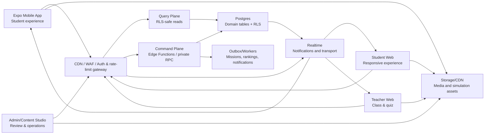
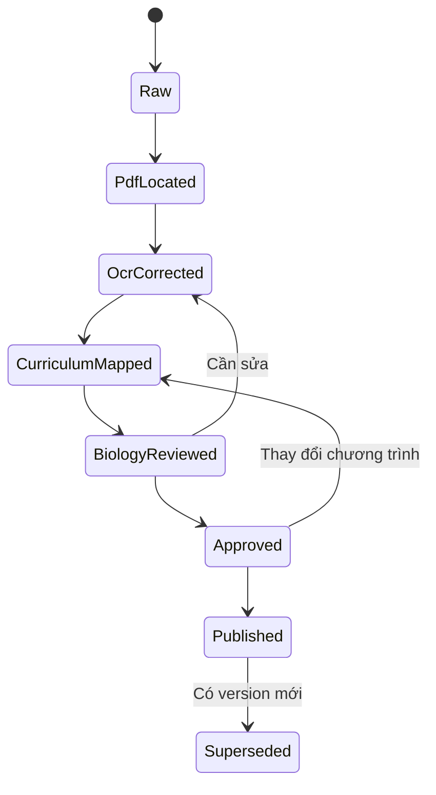
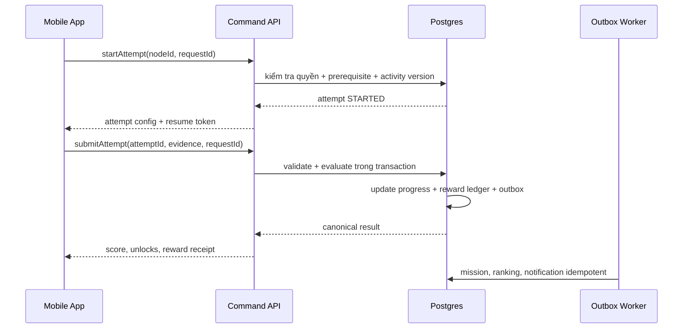

# BioLearn V2 - Blueprint hệ thống mobile-first, backend-first

- Trạng thái: **Kiến trúc mục tiêu, chưa triển khai**
- Ngày chốt định hướng: **2026-08-05**

Tài liệu này là nguồn quyết định chính cho BioLearn V2. Khi tài liệu này mâu
thuẫn với thứ tự triển khai trong roadmap cũ, tài liệu này được ưu tiên.

## 1. Kết luận kiến trúc

BioLearn V2 được xây như một sản phẩm mới chạy song song với hệ thống cũ:

- **Mobile-first về sản phẩm:** Expo app được tạo ngay từ giai đoạn nền móng.
- **Backend-first về nghiệp vụ:** domain, schema, quyền, transaction và hợp đồng
  API phải có trước khi màn hình thật được phép ghi dữ liệu.
- **Không phá hệ thống cũ:** code cũ được giữ trên `democode`/`main` làm
  legacy/reference và nguồn đối soát; V2 được xuất sang repository private mới,
  không chuyển từng component cũ sang app mới một cách máy móc và không merge
  trở lại `main` legacy.
- **Modular monolith:** một Postgres/Supabase được chia domain rõ ràng; chưa dùng
  microservice khi chưa có nhu cầu vận hành thực tế.
- **Server-authoritative:** client không tự quyết định reward, progress, streak,
  leaderboard, ghép trận, điểm PvP hay trạng thái publish nội dung.
- **Vertical slice:** làm hoàn chỉnh một lát cắt từ SGK đến Map, lesson, lab,
  Mini Boss, progress và reward trước khi mở rộng toàn bộ lớp 6-12.

“Xây lại hoàn toàn” ở đây có nghĩa là tạo nền tảng, schema và dữ liệu V2 sạch từ
empty migrations trong project mới. Nó không có nghĩa là xóa code/database cũ.
Mặc định V2 không import legacy; nếu sau này cần chuyển tài khoản/tiến độ thật,
đó là dự án migration riêng có dry-run, đối soát và rollback.

## 2. Phản biện hệ thống hiện tại

### 2.1. Điểm có thể giữ làm tài sản tham khảo

- Tên và định hướng thương hiệu BioLearn.
- Danh mục tính năng, route và kinh nghiệm nghiệp vụ từ app cũ.
- PDF SGK, mô hình 3D, âm thanh, avatar và các asset đã kiểm kê.
- Một số ý tưởng mô phỏng/game 3D đã có.
- Supabase là lựa chọn phù hợp cho giai đoạn đầu nếu dùng RLS và command layer đúng.

### 2.2. Điểm không được mang nguyên sang V2

- Component/màn hình hàng trăm đến hàng nghìn dòng trộn UI, query và luật chơi.
- Supabase query gọi trực tiếp rải rác trong screen/component.
- `profiles.class_progress`, mission và inventory chứa nghiệp vụ lớn trong JSONB.
- Client truyền `userId`, XP hoặc coin cho RPC rồi backend cộng trực tiếp.
- Policy `FOR ALL USING (true)` hoặc tắt RLS để “dễ đọc/ghi”.
- Client/host làm nguồn sự thật cho PvP, timer, câu hỏi hoặc điểm.
- Script SQL/CJS rời rạc, có `TRUNCATE`, delete-before-insert hoặc đường dẫn tuyệt đối.
- Nội dung bài học hard-code trong Map/UI hoặc lấy thẳng từ TXT/OCR.
- CSS/theme override toàn cục và màu cố định trong từng component.
- Phát triển tất cả tính năng cùng lúc nhưng không có test, telemetry và release gate.

### 2.3. Rủi ro cao nhất phải xử lý đầu tiên

1. **Gian lận kinh tế:** reward phải được tính từ kết quả attempt phía server và
   ghi bằng ledger có idempotency.
2. **Quyền dữ liệu:** mọi bảng người dùng, lớp học, quiz và battle phải có RLS
   theo owner/role/organization; không có policy mở để tiện phát triển.
3. **Nội dung sai:** content chưa `APPROVED` không được xuất hiện trong app.
4. **Mất tiến trình:** progress phải là bản ghi chuẩn hóa, không phải một object
   lớn bị nhiều màn hình ghi đè.
5. **PvP không công bằng:** Realtime chỉ vận chuyển event; server quyết định match,
   câu hỏi, thời gian hợp lệ, đáp án và điểm.

## 3. Nguyên tắc kỹ thuật bắt buộc

- TypeScript `strict` cho toàn bộ V2.
- Domain package không import React, Expo, DOM, Supabase client hoặc UI library.
- Screen không gọi `.from()`, `.rpc()` hay Edge Function trực tiếp; chỉ gọi service/use-case.
- Hợp đồng input/output được version và validate runtime.
- Database thay đổi duy nhất bằng migration đã commit.
- Mọi command có `requestId`/idempotency key.
- Mọi thay đổi tiền, XP, reward, role và publish đều có audit trail.
- Mọi endpoint có rate limit, payload/query/concurrency limit và timeout theo
  `SECURITY_BASELINE.md`; đăng nhập mật khẩu tối đa 5 lần thất bại/15 phút.
- Mọi trust boundary runtime-validate schema strict; secret chỉ ở server secret
  store và CI phải quét current diff + Git history.
- Published content là immutable; sửa nội dung tạo version mới.
- Không dùng `any` để né schema; không dùng `Record<string, unknown>` cho dữ liệu
  nghiệp vụ cốt lõi nếu có thể định nghĩa discriminated union.
- Không bắt đầu feature mới nếu vertical slice đang đỏ ở CI hoặc staging.

## 4. Kiến trúc tổng thể



### Query plane

Cho phép client đọc dữ liệu đã publish, hồ sơ của chính mình, tiến trình của
chính mình và dữ liệu lớp học đúng quyền thông qua RLS chặt chẽ.

### Command plane

Mọi thao tác có hậu quả nghiệp vụ đi qua Edge Function hoặc private database
function: submit attempt, cấp reward, nhận mission, publish content, tạo match,
trả lời PvP, khóa user, đổi role và gửi quà.

Topology runtime, cách phân tải nhưng giữ một nguồn dữ liệu thống nhất, ngưỡng
để tách match coordinator/read replica và chiến lược load shedding được chốt tại
`docs/adr/ADR-0001-RUNTIME-TOPOLOGY-AND-SCALING.md`. Không tách database/ranking
theo server, role hoặc màn hình.

## 5. Cấu trúc repository mục tiêu

V2 được đặt trong repository private mới theo ADR-0006, với lịch sử `main` mới.
Legacy tiếp tục ở repository `biolearn-mp` trên `democode`/`main`; không xuất
hiện trong worktree/snapshot V2. Nếu cần lấy lại một asset hoặc hành vi, phải
inventory, kiểm tra quyền/chất lượng và port có chủ đích. Không merge cả cây hoặc
lịch sử legacy vào V2.

Cây thư mục chi tiết, luật đặt file, mapping chức năng legacy và topology
Vercel/Expo được quy định bắt buộc tại
`docs/BIOLEARN_V2_REPOSITORY_STRUCTURE.md`. Mọi AI coding agent còn phải tuân
thủ `docs/AI_ENGINEERING_GUARDRAILS.md`.

```text
apps/
  mobile/                    Expo + Expo Router, student-first
  student-web/               Next.js App Router, student web responsive
  teacher-web/               quản lý lớp, quiz, báo cáo
  admin-web/                 vận hành, user, audit
  content-studio/            biên soạn và duyệt học thuật
  simulation-web/            runtime 2D/3D tách biệt cho WebView/web

packages/
  domain/                    entity, value object, use-case, state machine
  contracts/                 command/query DTO + runtime schema
  api-client/                typed client, auth, retries, errors
  curriculum/                curriculum/content schema và validator
  design-tokens/             màu, type, spacing, motion, glass policy
  simulation-protocol/       bridge typed giữa native và WebView
  test-fixtures/             dữ liệu test chuẩn, không chứa dữ liệu production
  tooling/                   eslint, tsconfig, test config dùng chung

supabase/
  migrations/                source of truth duy nhất của schema
  functions/                 command handlers theo domain
  seed/                      seed local/staging, mặc định từ chối production
  tests/                     pgTAP/RLS/integration tests

docs/
  adr/                       quyết định kiến trúc có ngày và hậu quả
  workflows/                 nghiệp vụ và sequence diagram
  runbooks/                  deploy, rollback, incident, data repair
```

## 6. Domain nghiệp vụ

| Domain | Trách nhiệm | Không được làm |
|---|---|---|
| Identity & Access | auth, profile, role, school/class membership | Không nhét role tin cậy vào state client |
| Curriculum | chương trình, YCCĐ, nguồn SGK, version, review | Không publish TXT/OCR thô |
| Journey | Map, node, prerequisite, unlock | Không hard-code luật mở khóa trong UI |
| Activity | lesson, challenge, lab, boss, attempt, evidence | Không để client tự chấm phần thưởng |
| Economy | XP, coin, energy, item, reward ledger | Không cập nhật balance từ nhiều màn hình |
| Engagement | streak, daily mission, notification | Không reset theo đồng hồ thiết bị |
| Competition | season, leaderboard, matchmaking, PvP | Không để host/client là trọng tài |
| Classroom | lớp, assignment, teacher dashboard | Không cho giáo viên xem lớp không thuộc quyền |
| Quiz Live | room, participant, question, answer, result | Không broadcast đáp án trước khi khóa câu |
| Media | tài liệu, video, 2D/3D catalog, license metadata | Không phát tán file chưa có quyền sử dụng |
| Operations | audit, moderation, feature flags, support | Không sửa dữ liệu âm thầm không có log |

## 7. Mô hình dữ liệu nền

### 7.1. Identity và trường/lớp

- `profiles`
- `roles`, `user_roles`
- `organizations`, `schools`
- `classrooms`, `classroom_members`
- `guardian_links` nếu sau này có nghiệp vụ phụ huynh

### 7.2. Chương trình và content

- `curriculum_programs`, `curriculum_versions`
- `grades`, `subjects`, `chapters`, `lessons`
- `learning_outcomes`
- `source_documents`, `source_references`
- `content_items`, `content_versions`
- `content_reviews`, `publication_releases`
- `media_assets`, `media_licenses`

### 7.3. Hành trình và hoạt động

- `journeys`, `journey_versions`
- `journey_nodes`, `node_prerequisites`
- `activity_definitions`, `activity_versions`
- `attempts`, `attempt_events`, `attempt_evidence`
- `user_node_progress`, `user_journey_progress`

### 7.4. Kinh tế và tương tác

- `wallets`, `reward_transactions`
- `reward_policies`, `reward_claims`
- `streaks`, `daily_mission_templates`, `daily_mission_assignments`
- `mission_progress`, `inventory_items`, `user_inventory`
- `leaderboard_seasons`, `score_events`, `leaderboard_snapshots`

### 7.5. Realtime và lớp học

- `matchmaking_tickets`, `matches`, `match_participants`, `match_events`
- `quiz_templates`, `quiz_sessions`, `quiz_participants`, `quiz_responses`
- `assignments`, `assignment_submissions`
- `notifications`, `audit_logs`, `outbox_events`

### 7.6. Bất biến quan trọng

- `reward_transactions.idempotency_key` là unique.
- Balance chỉ thay đổi trong cùng transaction với ledger entry.
- Một node progress duy nhất theo `(user_id, journey_version_id, node_id)`.
- Attempt luôn tham chiếu đúng `activity_version_id`; content update không đổi
  attempt lịch sử.
- Published journey/content version không update tại chỗ.
- Mọi answer PvP có server timestamp, sequence và unique key theo match/question/user.

## 8. Workflow nghiệp vụ chuẩn

### 8.1. Biên soạn và publish nội dung



Người soạn và người duyệt cuối phải được ghi nhận riêng. App production chỉ tải
release đã publish; không đọc draft trực tiếp.

### 8.2. Hoàn thành một trạm



Nếu retry do mất mạng, cùng `requestId` phải trả lại cùng kết quả, không cộng
thưởng lần hai.

### 8.3. Daily mission và streak

- Server xác định ngày theo timezone nghiệp vụ, không tin ngày của thiết bị.
- Mission được assign theo template/version; không lưu toàn bộ trong profile JSON.
- Streak cập nhật từ event học hợp lệ, có grace rule rõ và audit.
- Claim reward là command riêng, unique theo user/assignment.

### 8.4. Quiz live kiểu Kahoot/Quizizz

- Teacher tạo session từ quiz version đã lưu.
- Server phát `question_opened` với deadline; client chỉ nhận nội dung cần thiết.
- Answer được server timestamp và chỉ nhận trong cửa sổ hợp lệ.
- Score do server tính; Realtime chỉ phát trạng thái/leaderboard.
- Teacher reconnect được; session không phụ thuộc tab trình duyệt của host.

### 8.5. PvP

- Matchmaking dùng transaction/lock hoặc command service, không để client sửa
  ticket của đối thủ.
- Server chọn question set và seed, ký match configuration.
- Mỗi answer là command; server kiểm tra sequence, deadline và đáp án.
- Với quy mô đầu, Supabase Realtime dùng làm transport. Nếu cần tick-rate cao hoặc
  chống gian lận mạnh hơn, tách match coordinator chuyên dụng sau khi đo tải.

## 9. Hợp đồng command/query

Command envelope tối thiểu:

```ts
type CommandEnvelope<T> = {
  requestId: string;
  commandVersion: number;
  deviceId: string;
  clientVersion: string;
  payload: T;
};
```

Response phải có `requestId`, `serverTime`, result canonical và error code ổn
định. Không trả raw database error cho người dùng.

Nhóm error chuẩn:

```text
AUTH_REQUIRED | FORBIDDEN | NOT_FOUND | CONFLICT | RATE_LIMITED
PREREQUISITE_NOT_MET | ATTEMPT_EXPIRED | CONTENT_VERSION_MISMATCH
ALREADY_CLAIMED | VALIDATION_FAILED | INTERNAL_ERROR
```

## 10. Chiến lược mobile

### 10.1. Công nghệ

- React Native + Expo, TypeScript strict và Expo Router.
- Development build từ đầu; Expo Go chỉ dùng thử nghiệm rất sớm.
- New Architecture là mặc định; dependency phải được kiểm tra tương thích trước.
- Supabase session dùng storage adapter dành cho React Native.
- Cache/offline dùng SQLite cho published content, queue và attempt draft.
- Server state qua query/cache layer; state game phức tạp dùng reducer/state machine
  thuần domain thay vì global store tùy tiện.

Phiên bản SDK cụ thể phải được kiểm tra lại lúc khởi tạo và khóa trong lockfile;
không lấy version trong tài liệu này làm lệnh cài đặt vĩnh viễn.

### 10.2. Kiến trúc app

```text
apps/mobile/src/
  app/                        route files mỏng
  features/
    journey/
    activity/
    lab/
    battle/
    missions/
    profile/
  ui/                         primitive và composite dùng chung
  services/                   adapter API, storage, audio, haptics
  providers/                  auth, query, theme, feature flags
```

Route chỉ compose feature. Component không biết cấu trúc bảng Supabase.

### 10.3. Offline

- Offline đọc nội dung đã tải và tiếp tục attempt draft được hỗ trợ có giới hạn.
- Reward, streak, leaderboard và PvP chỉ được chốt khi server xác nhận.
- Queue lưu command có idempotency key và retry với backoff.
- Content version bị thu hồi không được bắt đầu attempt mới offline.

## 11. Simulation 2D/3D

### 2D native

Ưu tiên cho drag-drop, diagram labeling, kính hiển vi 2D, bảng Punnett, nguyên
phân, đo lường và thí nghiệm có biến. Dùng gesture/animation native và state
machine domain để đạt cảm giác game, haptics và hiệu năng tốt.

### 3D giai đoạn đầu

- Giữ simulation web tối ưu trong WebView có bridge typed.
- App gửi: theme, locale, safe area, activity version, attempt token.
- Simulation gửi: `ready`, `event`, `checkpoint`, `completed`, `error`.
- Không tin event `completed` đơn lẻ; backend đánh giá evidence theo rule.
- Asset 3D có manifest, version, checksum, kích thước và fallback.

Chỉ đầu tư 3D native khi WebView không đạt KPI về FPS, memory, thời gian tải hoặc
trải nghiệm. Không để việc chuyển toàn bộ 3D chặn nền tảng học tập.

## 12. Hệ thống UI BioLearn

### 12.1. Ngôn ngữ hình ảnh

BioLearn phải trông như một game khám phá Sinh học trên iPhone, không phải web
dashboard được thu nhỏ:

- Map là màn hình chính, full-screen và có chiều sâu cảnh quan.
- Mỗi chương là một “biome” Sinh học: tế bào, vi sinh, thực vật, cơ thể người,
  di truyền, tiến hóa, sinh thái.
- Hình dạng node phản ánh loại hoạt động: lesson, lab, Mini Boss, Boss, 3D.
- Asset chính là hình minh họa/simulation nguyên bản; icon hệ thống chỉ dùng cho
  hành động quen thuộc.
- Haptics, sound cue và motion có mục đích, có chế độ giảm chuyển động.

### 12.2. Liquid Glass đúng cách

Liquid Glass là lớp chức năng nổi trên content, không phải skin phủ lên mọi card.

Nên dùng cho:

- Bottom tab bar.
- Top HUD chứa XP, coin, streak và energy.
- Floating back/close/action controls.
- Bottom sheet header và control tạm thời trên simulation.

Không dùng cho:

- Toàn bộ background, nội dung bài học, bảng dữ liệu hay mọi card.
- Các lớp glass lồng nhau.
- Văn bản dài trên nền ảnh biến động.

Trên iOS hỗ trợ native glass khi API có sẵn. Thiết bị/iOS không hỗ trợ phải dùng
fallback material đồng nhất; tôn trọng Reduce Transparency và Increase Contrast.

### 12.3. Chống giao diện “AI/vibecode”

- Không gradient tím-xanh đại trà, orb/bokeh, glow neon và heading khổng lồ.
- Không biến mọi section thành card bo tròn 24-32 px.
- Không dùng emoji làm icon sản phẩm chính.
- Không lặp một layout card-grid cho Map, lesson, lab và profile.
- Không rải màu hex trong component; mọi màu qua semantic token.
- Không dùng glass để che việc thiếu asset hoặc thiếu hierarchy.
- Mỗi màn hình phải có một nhiệm vụ chính và một vùng focus rõ.

### 12.4. Theme

- Light: phòng lab ban ngày, bề mặt sạch, tương phản tốt, cảnh quan tươi nhưng
  node/controls nổi rõ.
- Dark: galaxy/vũ trụ BioLearn như tinh thần hệ thống legacy, xanh đen sâu, sao
  và điểm nhấn phát quang có kiểm soát; không chỉ đảo màu hoặc phủ đen.
- Geometry, touch target và trạng thái không đổi giữa theme.
- Trạng thái luôn có icon/hình dạng/nhãn, không chỉ khác màu.
- Background là scene layer độc lập, có fallback và error boundary; thay ảnh
  tĩnh/nền động không được thay contract hoặc làm hỏng auth, progress, ranking,
  PvP và teacher flow. Contract chi tiết nằm trong
  `workflows/STARTUP_AUTH_DAILY_STATION_VISUAL_SPEC.md`.

### 12.5. Điều hướng mobile đề xuất

Bottom tabs ổn định:

1. `Hành trình` - Map và bài đang học.
2. `Phòng Lab` - mô phỏng 2D/3D và thực hành.
3. `Thi đấu` - leaderboard, PvP, quiz live.
4. `Nhiệm vụ` - daily, streak và sự kiện.
5. `Hồ sơ` - avatar, thành tích, tài liệu/video đã lưu, cài đặt.

Teacher/Admin là web app riêng theo nghiệp vụ; không nhồi giao diện vận hành vào
mobile student app.

## 13. Phạm vi sản phẩm theo release

### Vertical Slice 0 - chứng minh nền móng

- Auth student và profile tối thiểu.
- Một lớp, một cụm bài đã được duyệt học thuật.
- Map có lesson, lab, Mini Boss và reward node.
- Một lesson, một activity tương tác và một bài thực hành thật.
- Có thể chọn “làm sữa chua” nếu audit SGK xác nhận đủ nguồn, an toàn và YCCĐ.
- Attempt, progress, unlock và reward ledger end-to-end.
- Light/dark, offline draft, telemetry và admin review tối thiểu.

### Release 1 - hành trình học tập

- Một lớp hoàn chỉnh.
- Mission, streak, coin/XP, inventory, profile, tài liệu và video.
- Leaderboard theo mùa và chống ghi điểm lặp.
- Content Studio đủ biên soạn, review, publish và rollback version.

### Release 2 - lớp học và live quiz

- Teacher classroom, assignment, quiz template/session và báo cáo.
- Student join bằng code/QR, reconnect và kết quả server-authoritative.
- Admin user/role/audit/support.

### Release 3 - social và simulation mở rộng

- Matchmaking/PvP có season, anti-abuse và moderation.
- Catalog 2D/3D nhiều lớp, asset download policy và performance budget.
- Mở rộng lần lượt lớp 6-12 theo content gate, không theo số lượng màn hình.

## 14. Workflow phát triển

### 14.1. Môi trường

- Supabase local, staging và production tách biệt.
- EAS profiles: development, preview/internal, production.
- Dữ liệu test là synthetic; không clone hồ sơ học sinh production về local.
- Secret chỉ nằm trong secret manager; publishable key không được cấp quyền vượt RLS.

### 14.2. Git và review

1. Mỗi task có ID blueprint/roadmap và acceptance criteria.
2. Nhánh ngắn, PR nhỏ; không trộn migration, refactor và redesign không liên quan.
3. Migration review riêng với rollback/forward-fix plan.
4. Content review tách khỏi code review.
5. Merge khi CI xanh và preview build kiểm tra được.

### 14.3. CI bắt buộc

- Format, lint, TypeScript, unit test và contract test.
- Database migration từ empty và từ snapshot staging.
- pgTAP/RLS test theo student/teacher/admin/anonymous.
- Edge Function tests và idempotency tests.
- Rate-limit/oversized/malformed/abuse/load tests theo route registry.
- Mobile component tests, E2E smoke và screenshot light/dark.
- Secret scan current + history, dependency/SAST audit có kiểm soát và asset
  budget check; Critical/High chặn production theo security baseline.

### 14.4. Definition of Done

- Nghiệp vụ đúng và có test cho happy/error/retry/permission.
- Có loading, empty, offline, reconnect và telemetry.
- Light/dark, Dynamic Type, reduced motion/transparency và touch target đạt chuẩn.
- Không có Supabase call trong screen.
- Không có reward/progress do client tự quyết định.
- Nội dung có sourceRefs và approval.
- Runbook/ADR/status được cập nhật.

## 15. Lộ trình triển khai V2

| ID | Giai đoạn | Mục tiêu | Gate để đi tiếp |
|---|---|---|---|
| V2-R0 | Tách repository | Tạo Git private mới, export allowlist, cô lập dữ liệu/deploy | Lịch sử mới, scan sạch, branch protection, không nối legacy DB |
| V2-A0 | Khóa kiến trúc | Freeze legacy, threat model, ADR, inventory API/schema | Không còn quyết định nền tảng mơ hồ |
| V2-A1 | Foundation song song | Monorepo V2, Expo shell, tokens, local Supabase, CI | Mobile build + migration + tests chạy từ sạch |
| V2-A2 | Backend core | Auth/role, curriculum, journey, attempt, progress, ledger | RLS/idempotency/contract tests xanh |
| V2-A3 | Vertical slice | Một cụm bài end-to-end trên iPhone | Học thật, lab thật, Mini Boss, reward đúng |
| V2-A4 | Engagement | Mission, streak, profile, media, leaderboard | Server time, ledger và offline/retry đúng |
| V2-A5 | Teacher/Admin | Classroom, content studio, review, audit | Phân quyền và workflow publish hoàn chỉnh |
| V2-A6 | Live systems | Quiz live, matchmaking, PvP | Reconnect, server authority, abuse tests |
| V2-A7 | Simulation scale | 2D/3D catalog, download/cache, performance | Đạt budget iPhone mục tiêu |
| V2-A8 | Migration/release | User/progress migration, pilot, rollout | Đối soát dữ liệu và rollback đã diễn tập |

Expo app bắt đầu ở `V2-A1`, không chờ đến cuối. Tuy vậy, screen chức năng chỉ
được nối dữ liệu thật sau khi contract/backend tương ứng vượt gate.

## 16. Chiến lược chuyển từ legacy

- Legacy nằm trong repository `biolearn-mp` ở trạng thái maintenance-only; V2
  nằm trong repository private mới theo ADR-0006. Không merge/cutover branch
  giữa hai lịch sử Git.
- Project database/auth/storage V2 được tạo mới và dựng từ empty migrations;
  mặc định không import legacy.
- Lập bảng mapping user, role, class progress, XP, coin, streak và inventory.
- Chỉ nếu người sở hữu sau này duyệt migration tài khoản/tiến độ: viết migration
  tool có dry-run, report chênh lệch và idempotency.
- Không copy JSONB cũ sang nguyên dạng; chuyển qua canonical mapping.
- Pilot bằng tài khoản nội bộ, sau đó nhóm nhỏ; dual-read chỉ trong thời gian ngắn.
- Cutover có feature flag, backup, reconciliation report và đường quay lại.
- Không xóa project/database cũ cho đến khi qua thời hạn lưu trữ và phê duyệt.

## 17. Việc chưa nên làm

- Không bắt đầu bằng vẽ hàng trăm màn hình hoặc làm đủ lớp 6-12.
- Không port tất cả component 3D sang native trước vertical slice.
- Không cài nhiều UI/state library trước khi có nhu cầu thật.
- Không xây microservice, Kubernetes hoặc event bus lớn cho MVP.
- Không sao chép giao diện Duolingo/Kahoot/Quizizz; chỉ học mô hình tương tác.
- Không dùng toàn bộ SGK/PDF trong app nếu quyền phân phối chưa được xác nhận.
- Không triển khai production database khi RLS và reward threat model chưa pass.

## 18. Bước bắt đầu được phép

Bước tiếp theo là `V2-R0`, chỉ tách repository và khóa wireframe/spec; chưa
scaffold runtime trong repository legacy:

1. Xác nhận Git provider, owner, tên và private visibility của remote V2.
2. Thực hiện runbook export allowlist, secret scan và khởi tạo lịch sử `main` mới.
3. Bật branch protection/CI nền và xác nhận không có connection/project ID legacy.
4. Chốt wireframe Splash, Student Auth, Teacher Auth và Trạm ngày light/dark theo
   `workflows/STARTUP_AUTH_DAILY_STATION_VISUAL_SPEC.md`.
5. Sau khi `V2-R0` đạt mới scaffold `V2-A1`; chưa chạy migration hosted production.
