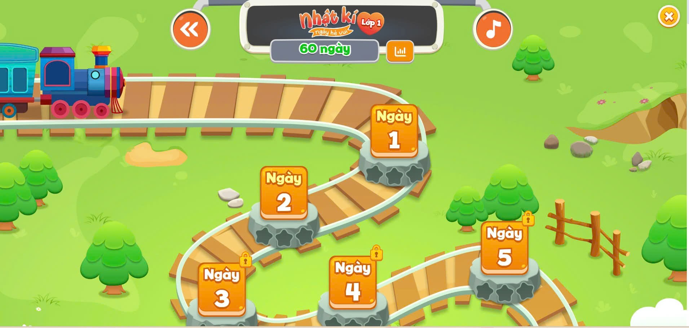

# Kế hoạch xây dựng lại và nâng cấp NextGen BioLearn

> **Quyết định mới ngày 2026-08-05:** BioLearn V2 được xây song song theo
> `docs/BIOLEARN_V2_SYSTEM_BLUEPRINT.md`, backend-first và khởi tạo Expo từ giai
> đoạn foundation. Bảng P0-P9 bên dưới được giữ để truy vết nghiên cứu trước đó;
> không tiếp tục dùng thứ tự “mobile ở P8” khi triển khai V2.

Đặc tả học viên mobile/web và phản biện mới nhất nằm tại
`docs/workflows/STUDENT_EXPERIENCE_V2.md`; tài liệu này chi tiết hóa scope sản
phẩm nhưng không được vượt gate V2-A0/A1 của blueprint.

## 1. Mục tiêu sản phẩm

Nâng cấp trải nghiệm học Sinh học theo một tuyến bản đồ giống hành trình qua các
trạm. Học sinh nhìn thấy vị trí hiện tại, các trạm đã hoàn thành, trạm bị khóa,
thực hành, Mini Boss và Boss chương. Các hệ thống 3D, Mission, Quiz, PvP, Teacher
và Admin hiện tại tiếp tục hoạt động như cũ.

Mobile được phát triển bằng **React Native + Expo ngay từ foundation**, song song
với backend contracts. Logic tiến trình, content và reward vẫn phải nằm trong
domain/backend trước khi screen mobile được phép ghi dữ liệu thật.

## 1.1. Căn cứ hình ảnh

Ảnh mẫu đã được lưu lâu dài tại:
`docs/assets/map-journey-visual-reference.png`.



Mọi công việc từ `P1.1` đến `P3.5` phải đọc
`docs/MAP_VISUAL_REFERENCE.md`. Ảnh được dùng để căn cứ tuyến đường cong, bệ
trạm, trạng thái khóa, vị trí hiện tại, thanh tiến độ và nhịp cảnh quan. Không
sao chép thương hiệu hoặc asset cụ thể của ảnh mẫu.

## 2. Phạm vi

### Trong phạm vi

- Map V2 dạng tuyến hành trình/trạm, responsive và hỗ trợ cảm ứng.
- Activity Engine cho hoạt động thực hành thực sự.
- Mini Boss theo cụm bài và tích hợp Boss chương hiện có.
- Chuẩn hóa content schema, tiến trình, attempt và reward.
- Kiểm định chương trình, SGK Kết nối tri thức và toàn bộ bài thực hành.
- Tách logic dùng chung để chuẩn bị monorepo web/mobile.
- Ứng dụng Expo cho học sinh, ưu tiên Map và gameplay.
- Theme sáng/tối nhất quán trên web và mobile.
- Migration an toàn, feature flag, kiểm thử và tài liệu khôi phục.

### Ngoài phạm vi cho đến khi có yêu cầu mới

- Viết lại 3D, Mission, Quiz room, PvP, Teacher hoặc Admin.
- Thay Supabase bằng backend khác.
- Đưa toàn bộ mô hình 3D web sang native trong giai đoạn đầu.
- Thay toàn bộ thiết kế và thương hiệu của ứng dụng.
- Xóa dữ liệu tiến trình cũ hoặc xóa Map cũ trước khi Map V2 ổn định.

## 3. Kiến trúc mục tiêu

```text
apps/
  web/                       React + Vite
  mobile/                    React Native + Expo + Expo Router

packages/
  game-core/                 mở khóa, tiến trình, điểm, reward rules
  biology-content/           schema và dữ liệu trạm/activity
  supabase-client/           query/repository dùng chung
  design-tokens/             token màu, khoảng cách, trạng thái

supabase/
  migrations/                migration có thứ tự, không sửa lịch sử
  seed/                      seed chỉ dành cho môi trường cho phép

docs/
  PROJECT_REBUILD_ROADMAP.md
  IMPLEMENTATION_STATUS.md
  MAP_VISUAL_REFERENCE.md
  assets/
    map-journey-visual-reference.png
```

Đây là kiến trúc đích, không phải yêu cầu di chuyển thư mục ngay. Chỉ chuyển sang
monorepo khi các module dùng chung đã có ranh giới và test rõ ràng.

## 4. Mô hình hành trình

Mỗi lớp có nhiều chương. Mỗi chương là một tuyến gồm các node có thứ tự:

```text
LESSON → CHALLENGE → LAB → MINI_BOSS → ... → CHAPTER_BOSS
```

| Loại trạm | Mục đích | Hành vi chính |
|---|---|---|
| `lesson` | Học và luyện kiến thức | Dùng gameplay hiện có qua adapter |
| `challenge` | Củng cố bằng tương tác ngắn | Ghép, sắp xếp, phân loại, điền |
| `lab` | Thực hành có thao tác và quan sát | Dùng Activity Engine, không giả làm quiz |
| `mini_boss` | Kiểm tra một cụm bài | Nhiều pha, HP, kỹ năng, retry |
| `chapter_boss` | Kiểm tra toàn chương | Tích hợp route Boss hiện có |
| `biology_3d` | Khám phá mô hình liên quan | Mở 3D hiện có bằng route/deep link |
| `reward` | Mốc thưởng | Nhận thưởng một lần, chống ghi lặp |

Trạng thái node:

```text
locked | available | current | in_progress | completed | mastered
```

Quy tắc mở khóa phải nằm trong `game-core`, không nằm rải rác trong component.

## 5. Schema dữ liệu dự kiến

Schema cuối cùng sẽ được xác nhận bằng migration riêng. Không tạo bảng trực tiếp
trên production từ nội dung minh họa dưới đây.

```ts
type JourneyNode = {
  id: string;
  classId: number;
  chapterId: number;
  order: number;
  type:
    | "lesson"
    | "challenge"
    | "lab"
    | "mini_boss"
    | "chapter_boss"
    | "biology_3d"
    | "reward";
  title: string;
  activityId?: string;
  prerequisiteIds: string[];
  rewardPolicyId?: string;
  metadata?: Record<string, unknown>;
};

type ActivityDefinition = {
  id: string;
  kind:
    | "multiple_choice"
    | "matching"
    | "ordering"
    | "classification"
    | "diagram_labeling"
    | "experiment"
    | "observation"
    | "measurement";
  version: number;
  objective: string;
  instructions: string[];
  content: Record<string, unknown>;
  evaluation: Record<string, unknown>;
};

type ActivityAttempt = {
  id: string;
  userId: string;
  nodeId: string;
  activityVersion: number;
  status: "started" | "submitted" | "passed" | "failed" | "abandoned";
  score: number;
  evidence: Record<string, unknown>;
  startedAt: string;
  completedAt?: string;
};
```

Mọi định nghĩa nội dung còn phải có `sourceRefs`, `learningOutcomeIds`, version
và `verificationStatus` theo `docs/CURRICULUM_CONTENT_STANDARD.md`.

### Tương thích dữ liệu cũ

- `profiles.class_progress` vẫn được đọc trong giai đoạn chuyển tiếp.
- Một adapter chuyển các key như `chapter_lesson_level` sang node ID mới.
- Reward hiện có tiếp tục đi qua RPC; bổ sung idempotency trước khi mở Map V2 cho
  tất cả người dùng.
- Không ghi đè tiến trình cũ. Trong giai đoạn thử nghiệm có thể dual-read; chỉ
  dual-write khi có test và kế hoạch đối soát.

## 6. Bảng kế hoạch thực hiện

Trạng thái dùng trong bảng: `TODO`, `DOING`, `BLOCKED`, `DONE`.

| ID | Giai đoạn | Công việc chính | Sản phẩm bàn giao | Điều kiện hoàn tất |
|---|---|---|---|---|
| P0.1 | Baseline | Chụp lại cấu trúc route, schema đang dùng và luồng reward/progress | Tài liệu hiện trạng | Có danh sách route, bảng, RPC và rủi ro |
| P0.2 | Baseline | Ghi nhận build/lint hiện tại, lỗi tồn đọng và viewport chuẩn | Báo cáo baseline | Phân biệt được lỗi cũ và lỗi mới |
| P0.3 | An toàn | Thiết lập feature flag `mapV2` và đường quay lại Map cũ | Cơ chế bật/tắt | Có thể quay lại Map cũ không mất dữ liệu |
| C0.1 | Học thuật | Xác minh cấu trúc PDF lớp 6-12 và chọn nguồn chuẩn | Source inventory | Mỗi lớp có một PDF `CANONICAL` |
| C0.2 | Học thuật | Xác minh Chương trình GDPT và sửa đổi hiện hành | Legal baseline | Có ngày kiểm tra và phạm vi ảnh hưởng |
| C0.3 | Học thuật | Lập ma trận lớp-chương-bài-yêu cầu cần đạt | Curriculum matrix | Mỗi bài có nguồn chương trình và trang SGK |
| C0.4 | Học thuật | Hiệu đính OCR, thuật ngữ, ký hiệu và glossary | Canonical text | Không lấy nguyên TXT làm content |
| C0.5 | Học thuật | Lập ma trận toàn bộ bài thực hành | Practice matrix | Có mục tiêu, dụng cụ, an toàn, bước và báo cáo |
| C0.6 | Học thuật | Duyệt chuyên môn và version nội dung | Approved content | Chỉ content được duyệt mới được publish |
| P1.1 | Thiết kế | Wireframe Map V2 dựa trên ảnh tham chiếu cho mobile, tablet, desktop | Bộ wireframe | Đủ locked/current/completed/lab/boss và đã đối chiếu ảnh |
| P1.2 | Theme | Xây semantic tokens cho Map sáng/tối | Token + bảng tương phản | Đạt AA và không dùng màu làm tín hiệu duy nhất |
| P1.3 | UX | Xác định thao tác chạm, scroll, mở chi tiết trạm và resume | Luồng UX | Dùng được bằng chuột, bàn phím, cảm ứng |
| P2.1 | Core | Tách đọc `class_progress` khỏi `MapPage.jsx` | Progress adapter | Test được bằng dữ liệu cũ |
| P2.2 | Core | Tách luật mở khóa và xác định node hiện tại | Journey rules | Không phụ thuộc React/DOM |
| P2.3 | Core | Tách reward policy và chống nhận thưởng lặp | Reward contract | Retry không nhân đôi reward |
| P2.4 | Content | Đưa `classData` ra khỏi component thành schema/version rõ | Content module | Validate node và truy vết được curriculum/source |
| P3.1 | Map V2 | Xây `BiologyJourneyMap` và track responsive | Map cơ bản | Không ảnh hưởng Map cũ |
| P3.2 | Map V2 | Xây node cho lesson/challenge/lab/boss/reward | Bộ node | Mỗi loại có icon, trạng thái và tooltip |
| P3.3 | Map V2 | Avatar/tàu chỉ vị trí, auto-focus node hiện tại | Resume UX | Không giật layout, hỗ trợ reduced motion |
| P3.4 | Map V2 | Sheet/modal chi tiết trạm và CTA | Station detail | Loading/error/locked rõ ràng |
| P3.5 | Map V2 | Kết nối route gameplay/Boss/3D hiện có | Route adapters | 3D, Mission, Quiz không đổi hành vi |
| P4.1 | Practice | Định nghĩa Activity Engine và registry renderer | Activity shell | Có lifecycle start/submit/retry/resume |
| P4.2 | Practice | Làm `classification` và `diagram_labeling` | 2 activity tương tác | Có đánh giá, feedback và accessibility |
| P4.3 | Practice | Làm `experiment`/`measurement` | Thực hành thật | Có biến, thao tác, quan sát, kết luận |
| P4.4 | Practice | Thay dữ liệu thực hành mẫu đang là quiz | Content thực hành chuẩn | Đúng SGK/YCCĐ, có trang nguồn và chuyên môn duyệt |
| P4.5 | Practice | Lưu attempt và evidence | Persistence | Reload/resume không mất bài đang làm |
| P5.1 | Mini Boss | Thiết kế encounter theo cụm bài | Boss schema | Có phase, HP, skill, question/activity pool |
| P5.2 | Mini Boss | Xây battle shell và state machine | Mini Boss MVP | Pause/retry/quit hoạt động đúng |
| P5.3 | Mini Boss | Cân bằng reward, stamina và điều kiện thắng | Rule set | Không farm reward, không khóa tiến trình sai |
| P5.4 | Mini Boss | Thêm ít nhất một Mini Boss mẫu | Nội dung mẫu | Có test và nghiệm thu gameplay |
| P6.1 | Database | Thiết kế migration cho journey/activity/attempt | SQL migration draft | Có backup, rollback và review |
| P6.2 | Database | Chạy migration ở môi trường local/staging | Báo cáo migration | Không chạy production, đối soát đủ |
| P6.3 | Database | RLS và quyền truy cập | Policies | Học sinh chỉ sửa attempt của mình |
| P6.4 | Database | Telemetry lỗi và event gameplay tối thiểu | Event contract | Không lưu secret/dữ liệu nhạy cảm |
| P7.1 | QA web | Unit test core, schema và unlock rules | Test suite | Bao phủ nhánh tiến trình quan trọng |
| P7.2 | QA web | Integration test hoàn thành trạm/reward | Test flow | Retry/network error không ghi lặp |
| P7.3 | QA web | Visual QA 2 theme x 3 viewport | Ảnh/báo cáo QA | Không tràn, đè chữ, thiếu tương phản |
| P7.4 | Pilot | Bật Map V2 cho nhóm thử nghiệm | Pilot report | Có phản hồi và số lỗi chấp nhận được |
| P7.5 | Release web | Bật dần Map V2, giữ rollback | Web release | Theo dõi ổn định trước khi bỏ flag |
| P8.1 | Mobile prep | Chuyển repo sang workspace khi đủ điều kiện | Monorepo | Web build không đổi hành vi |
| P8.2 | Mobile prep | Tạo `apps/mobile` bằng Expo + Expo Router | App shell | Chạy Android/iOS development build |
| P8.3 | Shared | Dùng chung core/content/Supabase/tokens | Shared packages | Không có DOM API trong package chung |
| P8.4 | Mobile | Auth, session, theme, navigation | Mobile foundation | Session và theme được khôi phục đúng |
| P8.5 | Mobile | Map V2 native và station detail | Mobile Map | 360x800, safe area và touch đạt chuẩn |
| P8.6 | Mobile | Gameplay/activity/Mini Boss ưu tiên | Mobile gameplay | Parity chức năng cốt lõi với web |
| P8.7 | Mobile 3D | Mở 3D web qua WebView/deep link | 3D bridge | Có loading, offline và nút quay lại |
| P9.1 | Mobile QA | Test Android/iOS, offline, mạng yếu | QA report | Không mất attempt/progress |
| P9.2 | Release | Internal testing, crash reporting, privacy | Bản thử nội bộ | Không có secret, có rollback/versioning |
| P9.3 | Release | Phát hành theo giai đoạn | Store release | Theo dõi crash, reward và completion |

## 7. Nội dung thực hành tối thiểu

Một bài thực hành hợp lệ phải có:

- Mục tiêu học tập đo được.
- Dụng cụ/mẫu vật hoặc mô hình tương tác.
- Biến độc lập, biến phụ thuộc và biến kiểm soát nếu là thí nghiệm.
- Các bước thao tác mà học sinh thực sự thực hiện.
- Quan sát hoặc số đo do hành động của học sinh tạo ra.
- Phần ghi kết quả và kết luận.
- Tiêu chí đánh giá dựa trên evidence, không chỉ chọn đáp án.
- Feedback giải thích sai ở bước nào và cho phép thử lại hợp lý.

Không gắn nhãn `lab` hoặc “Thực hành” cho một tập câu hỏi trắc nghiệm thông thường.

Các activity ưu tiên cho bản đầu:

| Activity | Ví dụ Sinh học | Evidence cần lưu |
|---|---|---|
| `diagram_labeling` | Gắn nhãn cấu tạo tế bào | Vị trí nhãn, số lần thử |
| `classification` | Phân loại sinh vật | Nhóm đã chọn, lỗi từng mục |
| `ordering` | Sắp xếp nguyên phân | Thứ tự cuối, số lần đổi |
| `measurement` | Đọc kích thước dưới kính | Số đo, đơn vị, sai số |
| `experiment` | Điều kiện quang hợp | Giá trị biến, quan sát, kết luận |

## 8. Thiết kế Mini Boss tối thiểu

Mini Boss không chỉ là một quiz có ảnh nền. Một encounter gồm:

- 2 đến 3 phase, mỗi phase kiểm tra một kỹ năng khác nhau.
- Boss HP và học sinh stamina/energy có luật rõ ràng.
- Một câu hỏi hoặc activity đúng gây sát thương; sai có feedback và hậu quả hợp lý.
- Skill hỗ trợ có giới hạn, ví dụ gợi ý, loại đáp án hoặc hồi năng lượng.
- Pool nội dung có version để tránh lỗi tiến trình khi content thay đổi.
- Kết quả cuối cùng gồm score, accuracy, thời gian và evidence.
- Reward chỉ cấp một lần cho lần hoàn thành đủ điều kiện.

## 9. Chuẩn theme sáng/tối

Map V2 dùng semantic token dùng chung, rồi adapter mobile/web ánh xạ sang API
theme của nền tảng. Không kế thừa selector global của legacy. Tên token dự kiến:

```ts
type MapTheme = {
  pageBackground: string;
  surface: string;
  surfaceElevated: string;
  text: string;
  textMuted: string;
  track: string;
  trackShadow: string;
  focus: string;
};
```

Giá trị cuối cùng phải được đo tương phản, không sao chép máy móc từ ví dụ.

Ma trận kiểm tra bắt buộc cho mỗi UI:

| Viewport | Light | Dark | Input |
|---|---:|---:|---|
| 360x800 | Bắt buộc | Bắt buộc | Touch |
| 768x1024 | Bắt buộc | Bắt buộc | Touch/keyboard |
| 1440x900 | Bắt buộc | Bắt buộc | Mouse/keyboard |

## 10. Chiến lược Expo

Expo được chọn vì:

- Vẫn là React Native, nhưng có routing, build, update và thiết bị API dễ quản lý.
- Phù hợp để phát hành Android/iOS từ cùng một codebase.
- Development build cho phép thêm native module khi Expo Go không đủ.

Nguyên tắc triển khai:

- Dùng Expo Router cho navigation.
- Dùng SecureStore cho token nhạy cảm và AsyncStorage cho preference không nhạy cảm.
- Theme mobile theo system preference, cho phép người dùng override và lưu lựa chọn.
- Supabase session có adapter storage riêng cho mobile.
- 3D web được tích hợp qua WebView/deep link ở giai đoạn đầu.
- Chỉ chuyển 3D sang native nếu đo được nhu cầu, hiệu năng và chi phí triển khai.

## 11. Kiểm thử và nghiệm thu

### Kiểm thử tự động

- Unit: unlock rules, progress adapter, activity evaluator, reward idempotency.
- Component: trạng thái node, modal, activity controls, Mini Boss state.
- Integration: hoàn thành activity → lưu attempt → cập nhật tiến trình → reward.
- Route regression: 3D, Mission, Quiz, PvP và Admin vẫn mở đúng.
- Schema validation: node ID duy nhất, prerequisite tồn tại, không có chu trình.

### Kiểm thử thủ công

- Đổi theme ngay khi đang ở Map/activity/Mini Boss.
- Reload giữa một bài thực hành và tiếp tục attempt.
- Mạng chậm/mất mạng khi submit; retry không nhân đôi thưởng.
- Tài khoản mới, tài khoản có dữ liệu cũ và tài khoản hoàn thành toàn bộ.
- Back button trên web/mobile không làm mất tiến trình hoặc kẹt modal.
- Font dài, tiếng Việt có dấu và thiết bị màn hình hẹp không tràn.

## 12. Chiến lược phát hành và quay lại

1. `mapV2` mặc định tắt ở production.
2. Bật cho developer/test account.
3. Bật cho nhóm pilot nhỏ.
4. Theo dõi lỗi, completion rate, reward anomaly và crash.
5. Mở dần theo tỷ lệ.
6. Khi có sự cố, tắt flag để quay về Map cũ; không rollback database bằng cách
   xóa dữ liệu.
7. Chỉ xóa Map cũ sau ít nhất một chu kỳ phát hành ổn định và có phê duyệt.

## 13. Cách tiếp tục khi mất ngữ cảnh

Mỗi phiên mới thực hiện theo thứ tự:

```powershell
Get-Content -Raw AGENTS.md
Get-Content -Raw docs/AGENTS.md
Get-Content -Raw docs/PROJECT_REBUILD_ROADMAP.md
Get-Content -Raw docs/IMPLEMENTATION_STATUS.md
Get-Content -Raw docs/MAP_VISUAL_REFERENCE.md
Get-Content -Raw docs/CURRICULUM_CONTENT_STANDARD.md
Get-Content -Raw docs/CURRICULUM_SOURCE_INVENTORY.md
git status --short
git diff --check
```

Sau đó:

1. Chọn đúng một dòng `NEXT` trong `IMPLEMENTATION_STATUS.md`.
2. Đọc code và test liên quan trước khi sửa.
3. Không chạy script database chỉ dựa vào ghi chú cũ.
4. Sau khi hoàn tất, cập nhật trạng thái và ghi lệnh kiểm tra đã chạy.
