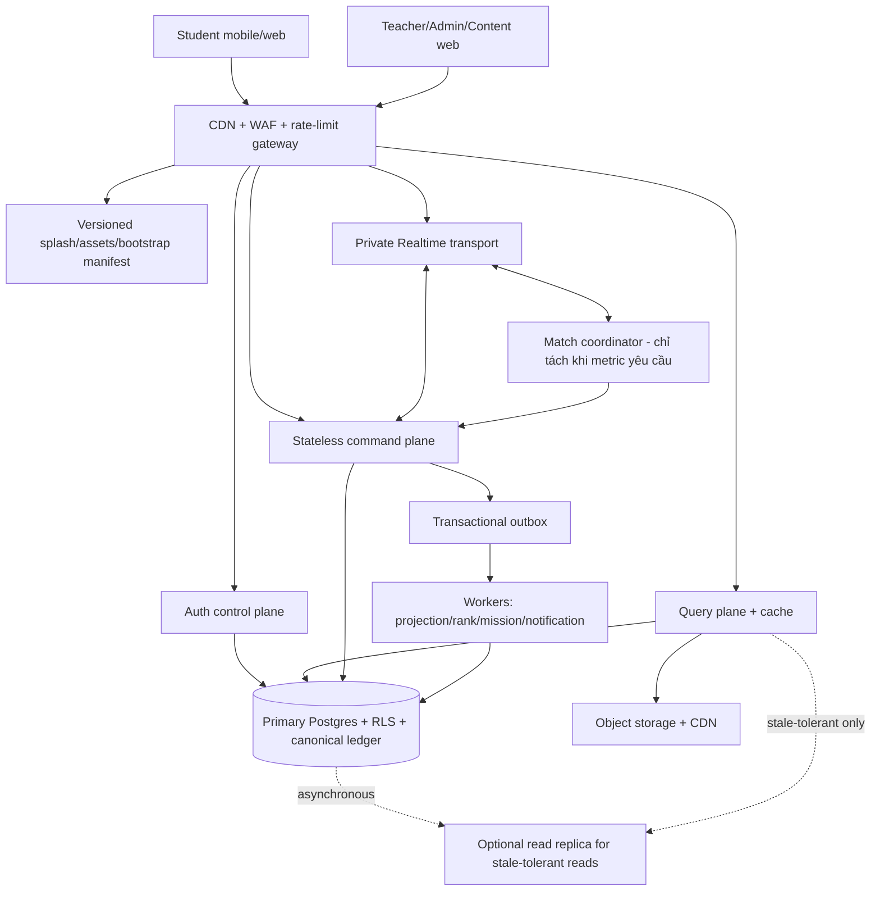

# ADR-0001 - Topology runtime, phân tải và nguồn dữ liệu thống nhất

- **Trạng thái:** Accepted cho foundation; capacity cụ thể chờ benchmark
- **Ngày:** 2026-08-12
- **Roadmap:** `V2-A0`

## Bối cảnh

BioLearn cần mobile và web cho học sinh, web cho giáo viên/admin, splash/auth,
leaderboard toàn hệ thống, lớp học live và PvP. Chủ dự án yêu cầu phân server để
tránh quá tải nhưng mọi người dùng vẫn thấy cùng dữ liệu, xếp hạng và trận đấu.

Nếu tách một server/database theo màn hình, role hoặc nhóm học sinh, hệ thống sẽ
có nhiều nguồn sự thật, khó ghép matchmaking, dễ cấp thưởng lặp và tạo sai lệch
leaderboard. Microservice sớm cũng tăng số điểm lỗi, secret, deploy và giao dịch
phân tán khi chưa có đội vận hành/metric chứng minh nhu cầu.

## Quyết định

Giữ **modular monolith theo domain với một canonical Postgres/ledger cho mỗi
environment**, nhưng phân tách deployment và tải theo workload. Các instance xử
lý request phải stateless và scale ngang; cache/queue/rate-limit store không được
trở thành nguồn sự thật cho reward, rank, role hay match result.

### Phân vai

- **Splash/bootstrap:** file nhỏ, versioned, cache tại CDN; progress bar phản ánh
  các bước thật như nạp manifest, session, public config và dữ liệu tối thiểu. Có
  timeout/offline/retry; không giữ secret và không cần “server splash” riêng.
- **Auth control plane:** login/register/recover/MFA/CAPTCHA và policy 5 failed/15
  phút. Không log credential. Provider limit và app/gateway limit là hai lớp khác nhau.
- **Query plane:** nội dung published, hồ sơ đúng quyền, Map và leaderboard snapshot.
  Dùng cache/projection; page size/query cost bắt buộc.
- **Command plane:** attempt, reward, mission, publish, quiz/PvP answer. Nhận intent
  + evidence, validate/authorize/idempotent và commit transaction ở primary.
- **Realtime:** private channel vận chuyển event/presence; không quyết định điểm,
  đáp án, reward hoặc match result. PvP/quiz ưu tiên server Broadcast thay vì fan-out
  trực tiếp mọi Postgres change.
- **Worker/outbox:** tính projection leaderboard, mission, notification và công
  việc nặng sau commit. Outbox bảo đảm event không mất/không chạy lặp vô hạn.
- **Storage/CDN:** model 3D, video và media versioned; upload đi qua pipeline riêng.

### Một hệ thống chung cho học sinh và giáo viên

Mobile, student web, teacher web, admin web và content studio có thể là deployment
riêng, nhưng dùng chung identity, contracts, domain commands và canonical database
trong cùng environment. Quyền trường/lớp nằm trong RLS/authorization, không nằm
trong việc chọn “server giáo viên” hay “server học sinh”.

Leaderboard toàn hệ thống và theo lớp đều là projection từ cùng ledger. PvP có
room/match partition để phân tải nhưng kết quả cuối chỉ được commit một lần vào
canonical match + reward ledger. Không có “xếp hạng server 1/server 2”.

## Khi nào mới tách thêm hạ tầng

Không mua read replica, Redis lớn, match service riêng hoặc Kubernetes chỉ để đề
phòng cảm tính. Chỉ tách khi load test và production telemetry liên tục vượt SLO:

- p95/p99 latency và error/timeout/429 theo route;
- DB CPU/IO, active connection/pool saturation, lock wait và slow query;
- Realtime concurrent connections, join rate, messages/s, payload, reconnect storm;
- outbox lag, queue depth/retry/dead-letter;
- match tick/answer latency và fairness;
- cache hit ratio, egress/storage/AI cost và crash-free sessions.

Thứ tự scale: tối ưu query/index/payload -> cache/CDN -> pool connection -> scale
stateless instance -> queue workload nặng -> read replica cho read chịu được trễ
-> tách match coordinator khi PvP benchmark chứng minh cần.

Read replica không dùng cho Auth, Storage, Realtime, command, reward claim hoặc
kết quả PvP mới nhất. Replica bất đồng bộ có thể trễ; leaderboard snapshot đọc từ
replica phải hiển thị `asOf/version`, còn mọi quyết định ghi dùng primary.

## Availability và load shedding

- Mỗi dependency có timeout, retry hữu hạn với exponential backoff+jitter và
  circuit breaker; command retry dùng idempotency key.
- Ưu tiên tải: auth/session và command đang diễn ra > nội dung/Map > leaderboard
  mới > cosmetic/presence > AI/background enrichment.
- Khi quá tải, hạ chất lượng có kiểm soát: dùng snapshot/cached content, giảm
  presence/animation, tạm hoãn worker/AI; không bỏ qua authorization hoặc cấp
  reward phía client.
- Kết nối edge/serverless đến Postgres dùng pooler phù hợp. Không mở connection
  trực tiếp theo từng request.
- Cấu hình Realtime có giới hạn client, event/s, presence/s và payload; client
  reconnect có backoff để tránh bão kết nối.

## Hệ quả

### Tích cực

- Học sinh/giáo viên/PvP/ranking thống nhất mà vẫn scale độc lập theo workload.
- Ít giao dịch phân tán, dễ audit, backup, đối soát và rollback hơn microservice sớm.
- Splash/auth không cạnh tranh trực tiếp với tải 3D/AI/background.

### Đánh đổi

- Primary database vẫn là tài nguyên cần bảo vệ bằng RLS, index, pool, cache và
  capacity planning.
- Projection có độ trễ hữu hạn; UI phải thể hiện freshness thay vì giả dữ liệu realtime.
- Auth 5/15 không thể chỉ dựa vào limiter trong một app instance; cần prototype
  gateway/provider chống bypass trước production.

## Phương án bị loại

1. **Database/server riêng theo role hoặc nhóm học sinh:** loại vì phân mảnh
   leaderboard, lớp và PvP; migration/reconciliation phức tạp.
2. **Microservice cho mọi domain ngay từ đầu:** loại ở MVP vì tăng failure mode và
   chi phí vận hành khi chưa có tải chứng minh.
3. **Chỉ tăng cấu hình một server lớn:** loại vì splash/static, command, Realtime,
   AI và worker có đặc tính scale khác nhau.
4. **Read replica giải quyết mọi quá tải:** loại vì replica có lag và không phục
   vụ trực tiếp Auth/Storage/Realtime hoặc command cần nhất quán mới nhất.

## Bằng chứng tham chiếu

- [Supabase Edge Functions architecture](https://supabase.com/docs/guides/functions)
- [Supabase Password Verification Hook](https://supabase.com/docs/guides/auth/auth-hooks/password-verification-hook)
- [Supabase connection management](https://supabase.com/docs/guides/database/connection-management)
- [Supabase serverless connection modes](https://supabase.com/docs/guides/database/connecting-to-postgres)
- [Supabase Realtime settings](https://supabase.com/docs/guides/realtime/settings)
- [Supabase Realtime reports](https://supabase.com/docs/guides/realtime/reports)
- [Supabase Read Replicas](https://supabase.com/docs/guides/platform/read-replicas)
