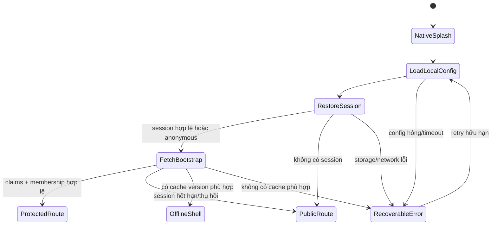

# ADR-0003 - App bootstrap, splash và session

- **Trạng thái:** Accepted cho foundation; auth limiter còn một spike bắt buộc
- **Ngày:** 2026-08-12
- **Roadmap:** `V2-A0`, `V2-A1`, `V2-A2`

## Bối cảnh

Ứng dụng phải mở nhanh, khôi phục session an toàn và không hiển thị nhầm route
được bảo vệ trong lúc auth chưa rõ. Splash/progress giả dễ che request treo; lưu
refresh token trong storage không phù hợp làm tăng hậu quả khi thiết bị hoặc XSS
bị khai thác. Mobile và student web cần cùng trạng thái nghiệp vụ nhưng adapter
session khác nhau.

Yêu cầu giới hạn đăng nhập mật khẩu tối đa 5 lần thất bại trong 15 phút phải áp
dụng cả khi kẻ tấn công gọi trực tiếp upstream Auth. Chỉ đặt limiter trong một
instance app hoặc UI không đáp ứng yêu cầu này.

## Quyết định

### Bootstrap là state machine hữu hạn

- Native splash chỉ giữ trong lúc thực sự tải config/session tối thiểu; mỗi bước
  có timeout, mã lỗi, retry hữu hạn và telemetry không chứa credential/token.
- Progress UI chỉ phản ánh state thật, không chạy phần trăm giả. Không chặn app
  để tải video, leaderboard, simulation hoặc dữ liệu cosmetic.
- Route protected chỉ mount sau khi backend xác nhận session và membership/role
  cần thiết. Client role chỉ dùng tối ưu UI, không dùng authorization.
- Offline shell chỉ dùng content/cache đã ký version và không cho client tự ghi
  reward/progress. Command offline được queue có idempotency và revalidate server.

### Session theo nền tảng

**Mobile:** dùng Supabase publishable key và `supabase-js` qua một
`SessionStoragePort`. Refresh/session material được lưu bằng adapter dựa trên OS
keystore/keychain (`expo-secure-store`) sau khi spike xác minh round-trip, kích
thước và hành vi reinstall/backup. Dữ liệu không nhạy cảm mới dùng AsyncStorage
hoặc database local. SecureStore không phải nguồn sự thật của progress.

Auto-refresh chỉ chạy khi app active; listener được đăng ký đúng một lần và hủy
đúng lifecycle. Logout xóa session local, cache theo user và WebView context; app
không tái sử dụng dữ liệu người dùng trước sau khi đổi account.

**Student web:** dùng Next.js + Supabase SSR cookie adapter và PKCE. Cookie/session
refresh nằm ở server boundary phù hợp; response auth/private không cache công
khai. Vì package SSR có thể thay đổi API, pin phiên bản và có test login, refresh,
logout, expired/revoked session, multi-tab và route prefetch.

Deep link/redirect của cả hai nền tảng dùng allowlist scheme/host/path, state/PKCE
và one-time exchange; không nhận redirect tùy ý từ query string.

### Gate auth 5 lần thất bại/15 phút

Trước khi mở password auth V2 phải hoàn tất spike `AUTH-RL-01`:

1. Chứng minh mọi password attempt, kể cả gọi thẳng Auth provider, đều đi qua
   enforcement có shared state và không reset khi scale/redeploy.
2. So sánh Password Verification Hook/provider-native control với gateway. Gateway
   đơn độc bị loại nếu public upstream vẫn bypass được.
3. Áp dụng bucket HMAC bảo vệ riêng tư theo identity + IP/device, cùng bucket IP/
   subnet; tối đa 5 thất bại trong rolling 15 phút cho identity bucket, không reset
   bởi login thành công ở nguồn khác.
4. Trả lỗi chung, `429` + `Retry-After`, không tiết lộ account tồn tại; thêm CAPTCHA
   thích ứng và MFA bắt buộc cho teacher/admin.
5. Test credential stuffing, password spraying, IPv6 rotation, NAT/shared school,
   concurrent attempts, enumeration và lockout denial-of-service.

Nếu plan/provider không cho cơ chế chống bypass đạt yêu cầu, password login chưa
được release. Khi đó phải đổi phương thức auth hoặc thêm control plane có khả năng
enforce upstream; không hạ yêu cầu im lặng.

## Bất biến bảo mật

- `EXPO_PUBLIC_*`, `NEXT_PUBLIC_*`, URL và publishable key đều được xem là công
  khai; không bao giờ chứa service role, signing secret hay credential bên thứ ba.
- Không log password, access/refresh token, auth code, raw cookie hoặc magic link.
- Backend verify token/claims và kiểm tra membership từ canonical data; không tin
  `role`, `userId`, `schoolId` do client gửi.
- Session restore lỗi phải fail closed về public/error shell, không giữ màn hình
  protected cũ trên thiết bị đổi user.

## Hệ quả

- Splash/auth không phải một server dữ liệu riêng và có thể scale độc lập theo
  ADR-0001.
- Có thêm adapter và test lifecycle, nhưng giảm rò token/cross-account cache.
- Password auth bị chặn release cho đến khi `AUTH-RL-01` chứng minh chống bypass;
  đây là gate chủ động, không phải việc để lại sau production.

## Bằng chứng tham chiếu

- [Supabase React Native Auth quickstart](https://supabase.com/docs/guides/auth/quickstarts/react-native)
- [Supabase server-side Auth](https://supabase.com/docs/guides/auth/server-side)
- [Supabase server package selection](https://supabase.com/docs/guides/auth/choosing-a-server-package)
- [Expo SecureStore](https://docs.expo.dev/versions/latest/sdk/securestore/)
- [React Native AppState](https://reactnative.dev/docs/appstate)
- [Expo Router typed routes](https://docs.expo.dev/router/reference/typed-routes/)

