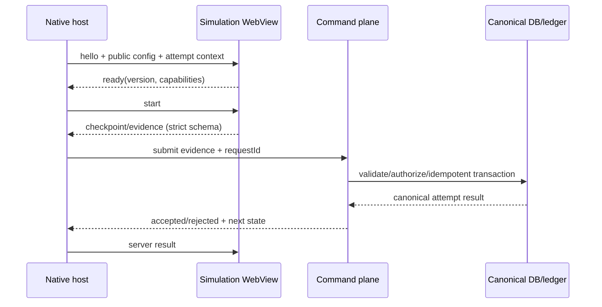

# ADR-0005 - Simulation WebView và bridge typed

- **Trạng thái:** Accepted cho foundation; performance budget chờ vertical slice
- **Ngày:** 2026-08-12
- **Roadmap:** `V2-A0`, chuẩn bị `V2-A3`/`V2-A7`

## Bối cảnh

Legacy có simulation/3D web đáng giá nhưng port toàn bộ sang native sớm tốn kém.
WebView cho phép tái sử dụng có chọn lọc, đồng thời tạo trust boundary mới: trang
web có thể điều hướng, gửi message giả, làm nghẽn bridge hoặc làm lộ session nếu
được cấp token quá rộng.

Simulation chỉ tạo evidence học tập. Nó không được tự quyết định hoàn thành,
reward, XP hoặc progress.

## Quyết định

### Phân tách runtime

`apps/simulation-web` là deployment/version riêng, chỉ host simulation đã inventory
và duyệt. Mobile host chỉ mở HTTPS origin/path allowlist từ manifest ký version.
Không mở URL do content, query string hoặc message tùy ý cung cấp.

Simulation asset công khai được version và cache CDN. Asset riêng dùng signed URL
scope hẹp, TTL ngắn. WebView **không nhận Supabase access/refresh token, service
key hoặc credential người dùng**. Native giữ session và trung gian submit evidence
qua typed command client.

### Protocol

`packages/simulation-protocol` sở hữu runtime schema hai chiều. Envelope tối thiểu:

```text
protocolVersion, messageId, direction, type,
simulationId, simulationVersion, attemptId, sequence, sentAt, payload
```

Handshake bắt buộc theo thứ tự `host.hello -> simulation.ready -> host.start`.
Message hợp lệ gồm lifecycle (`pause`, `resume`, `close`), checkpoint/evidence,
accessibility/config, recoverable error và telemetry đã allowlist. Message không
đúng version/state/sequence/schema bị bỏ và ghi metric đã redact.

Baseline ban đầu: tối đa **32 KiB/message**, **20 message/giây/WebView**, queue hữu
hạn và timeout handshake. Ảnh/model/file không đi qua bridge; chỉ gửi reference/
hash/evidence nhỏ. Mọi số giới hạn phải nằm trong registry/config và được chỉnh
theo benchmark, không hard-code rải rác.

`messageId` chống xử lý lặp trong phiên; command evidence vẫn dùng idempotency key
server. Timestamp client không dùng làm thời gian authoritative.

### WebView hardening

- `source` là exact allowlisted HTTPS origin/path; `originWhitelist` chỉ là một
  lớp, vẫn chặn navigation bằng callback và kiểm tra URL parse/canonicalization.
- Chặn mixed content, popup/new window, file/content URL, arbitrary scheme và
  third-party cookie. Chỉ mở external link allowlist qua browser hệ thống sau xác
  nhận phù hợp.
- Web runtime đặt CSP nghiêm, CORS allowlist, HSTS và không dùng inline/eval nếu
  simulation không chứng minh cần. Không chèn script động từ message/user input.
- Validate message ở cả native và web trước khi dispatch. Không parse rồi gọi
  handler bằng tên/property do payload điều khiển.
- Khi process crash, memory warning, offline, HTTP error hoặc timeout: pause
  attempt, giữ checkpoint đã server-ack, cho retry/exit; không tự cấp completion.
- Mỗi simulation có kill switch/version minimum để thu hồi asset lỗi mà không
  cần giả mạo progress.

### Authority flow



## Gate trước khi đưa simulation vào vertical slice

- Threat/protocol/contract tests, fuzz malformed/oversized/out-of-order messages.
- Navigation/redirect/mixed-content/CSP tests trên iOS và Android thật.
- FPS, memory, time-to-interactive, bundle/asset size, network yếu, background/
  resume và crash recovery trên thiết bị mục tiêu.
- Evidence replay/tamper test chứng minh không thể farm reward.
- Accessibility và phương án 2D/fallback nếu WebView không chạy.

Nếu không đạt KPI sau tối ưu asset/cache/bridge, mới lập ADR so sánh native 3D,
deep link hoặc remote rendering; không port cảm tính.

## Hệ quả

- Tái sử dụng simulation web có chọn lọc mà giữ session/reward authority ở native
  + server.
- Protocol versioning và giới hạn message tăng công việc test nhưng cô lập crash,
  overload và thay đổi độc lập giữa app/runtime.
- WebView không hoạt động offline hoàn toàn nếu asset chưa cache; UI phải nói rõ
  và có fallback.

## Bằng chứng tham chiếu

- [React Native WebView reference](https://github.com/react-native-webview/react-native-webview/blob/master/docs/Reference.md)
- [React Native WebView messaging guide](https://github.com/react-native-webview/react-native-webview/blob/master/docs/Guide.md)
- [OWASP input validation](https://cheatsheetseries.owasp.org/cheatsheets/Input_Validation_Cheat_Sheet.html)
- [OWASP HTML5 security](https://cheatsheetseries.owasp.org/cheatsheets/HTML5_Security_Cheat_Sheet.html)

