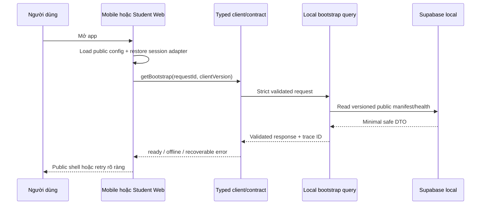

# V2-A1 - Vertical slice kỹ thuật foundation

- **Trạng thái:** Approved có điều kiện; chỉ cho scaffold foundation
- **Ngày:** 2026-08-12
- **Không phải:** vertical slice học thuật `V2-A3`

## 1. Vì sao cần một slice kỹ thuật

Vertical slice bài học thật chưa thể chọn an toàn: `C0.1` đến `C0.6` vẫn thiếu
PDF canonical, ma trận YCCĐ, hiệu đính và phê duyệt chuyên môn. Tự bịa một bài mẫu
để “có code” sẽ phá content gate.

V2-A1 vì vậy kiểm chứng đường kỹ thuật nhỏ nhất từ mobile/student web tới contract
và Supabase local, không chứa lesson/reward/PvP giả. Nó cho phép bắt đầu code mà
không biến placeholder thành nội dung production.

## 2. Luồng dọc được phép

Password login UI có thể có wireframe/shell nhưng không gọi production/upstream
Auth cho đến khi `AUTH-RL-01` đạt. Protected feature, reward và real curriculum
không nằm trong slice này.

## 3. Deliverable V2-A1 tối thiểu

- pnpm workspace pin runtime/package manager; một lockfile.
- `apps/mobile`: Expo Router shell, native splash, bootstrap state machine, light/
  dark semantic tokens, public/error/offline route.
- `apps/student-web`: Next.js shell dùng cùng state/contract semantics, responsive
  và light/dark; chưa tạo backend nghiệp vụ riêng.
- `packages/contracts`: strict bootstrap request/response/error schema và endpoint
  registry metadata.
- `packages/design-tokens`: semantic token thuần, không nhập Expo/DOM.
- `packages/tooling`: TypeScript/lint/test baseline dùng chung.
- `supabase`: local config + migration public manifest tối thiểu, grant/RLS test và
  seed giả lập fail-closed với non-local.
- CI: clean install, lockfile frozen, format/lint/type/test/build, secret current+
  history scan, dependency audit và generated/client bundle secret assertions.
- Capacity harness: smoke malformed/oversized/rate/payload/timeout cho bootstrap;
  chưa tuyên bố production capacity.

Chỉ tạo `packages/api-client` khi bootstrap endpoint thật được nối. Chỉ tạo
`packages/domain` khi có use case thuần thật. Không tạo app teacher/admin/content/
simulation rỗng.

## 4. Acceptance

1. Clone sạch với runtime pin có thể install và chạy scripts root bằng lockfile.
2. Mobile development build và student web production build thành công.
3. Cả hai hiển thị cùng các state `loading`, `ready`, `offline`, `recoverableError`
   từ contract; không có progress phần trăm giả hoặc protected-route flash.
4. Request unknown field, content type sai, body > budget và response sai schema bị
   từ chối trước UI/domain; có trace ID đã redact.
5. Public manifest versioned đọc được local; không có service role/client secret
   trong app bundle. RLS/grant test chứng minh anon không ghi được.
6. Light/dark, 360x800, keyboard/focus, reduced motion và screen-reader label được
   kiểm tra. Không chỉ dựa vào màu cho status.
7. Không có production migration/deploy/data/secret. Không copy legacy source/SQL/
   lockfile; dependency audit không có Critical/High chưa xử lý hoặc risk acceptance.

## 5. Gate sau slice

- `V2-A2` chỉ bắt đầu auth/identity khi `AUTH-RL-01` có thiết kế khả thi và test
  chống bypass/lockout DoS.
- Vertical slice học thuật `V2-A3` vẫn `BLOCKED` đến khi `C0.1`-`C0.6` đạt và
  reviewer chọn cụm lesson/practice/Mini Boss có source refs.
- PvP, teacher/admin, upload và 3D không được kéo sớm vào V2-A1 chỉ vì đã có shell.

## 6. Kết luận gate V2-A0

Foundation architecture đủ rõ để **bắt đầu scaffold V2-A1 trong phạm vi trên**.
Không có phê duyệt nào cho production, password auth thật, schema nghiệp vụ,
migration dữ liệu legacy hoặc nội dung học thuật. Mọi mở rộng ngoài slice phải quay
lại roadmap/ADR/security gate trước khi code.

