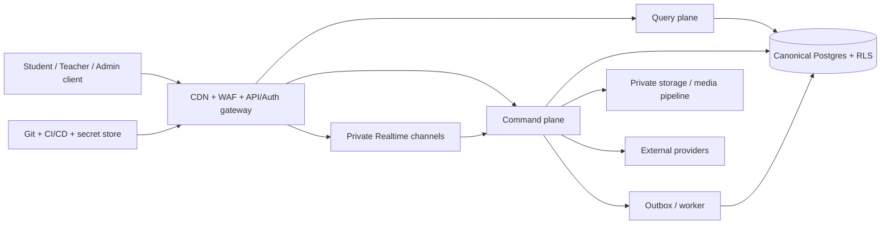

# BioLearn V2 - Threat model nền tảng

- **Roadmap:** `V2-A0`
- **Ngày:** 2026-08-12
- **Phạm vi:** student mobile/web, teacher/admin/content web, Supabase/Auth,
  command/query plane, Realtime/PvP/quiz, storage/3D, worker và CI/CD
- **Không thuộc audit này:** pentest production, cấu hình Supabase/Vercel đang chạy
  và dữ liệu thật; các phần đó phải có phiên kiểm tra được ủy quyền riêng

## 1. Tài sản cần bảo vệ

1. Tài khoản, session, role và quan hệ trường/lớp của học sinh/giáo viên.
2. Dữ liệu học tập, attempt, tiến trình, mission/streak và thư riêng.
3. Ledger XP/vàng/kim cương/năng lượng, leaderboard và kết quả PvP.
4. Câu hỏi/đáp án chưa công bố, nội dung SGK có bản quyền và trạng thái duyệt.
5. Credential server, database, storage, AI/third-party và signing key.
6. Tính sẵn sàng của splash/auth, Map, lớp học live, PvP và kênh thông báo.
7. Audit log, telemetry và khả năng điều tra mà không thu thập quá mức dữ liệu trẻ em.

## 2. Trust boundary và luồng dữ liệu

Mọi mũi tên qua boundary là dữ liệu không tin cậy cho đến khi đã xác thực,
validate, authorize và áp hạn mức. Realtime chỉ là transport; không phải trọng tài.

## 3. Threat register và control bắt buộc

| ID | Kịch bản đe dọa | Mức | Control/gate |
|---|---|---:|---|
| TM-01 | Brute force, credential stuffing, account enumeration hoặc cố ý khóa tài khoản | Critical | 5 failed/15 phút nhiều khóa, generic errors, CAPTCHA thích ứng, MFA teacher/admin, provider limit, audit không chứa credential |
| TM-02 | Client giả `userId`/role hoặc vượt quyền giữa học sinh/lớp/trường | Critical | Server suy ra identity, RLS theo owner/tenant, RBAC/ABAC, negative tests cross-user/cross-class |
| TM-03 | Client tự cộng XP/coin, giả completion, replay claim hoặc chạy song song | Critical | Intent + evidence, server policy, immutable ledger, idempotency unique key, transaction/locking, concurrency tests |
| TM-04 | Sửa queue/match của người khác, biết đáp án sớm, speed hack hoặc giả điểm PvP | Critical | Match state machine server-side, private channel, signed sequence/deadline, server chọn câu/chấm điểm, anti-replay/reconnect rules |
| TM-05 | Chiếm quiz room, spam join/answer hoặc teacher trái phép sửa room | Critical | Room capability ngắn hạn, class membership, host authority, per-room rate limit, answer reveal theo phase, audit |
| TM-06 | XSS từ slide/nội dung/import, URL ngoài hoặc message WebView | High | Structured content ưu tiên, sanitizer allowlist khi cần HTML, output encoding, CSP, URL/protocol allowlist, typed WebView protocol |
| TM-07 | File giả MIME, malware, parser exploit, overwrite avatar hoặc zip bomb | High | Owner-bound storage policy, quarantine, magic/size/signature, server filename, isolated scanner/parser, decompression limits |
| TM-08 | API/AI/upload bị spam làm hết CPU, RAM, DB connection, bandwidth hoặc ngân sách | High | Rate/concurrency/body/query/cost limits, timeout, queue, cache, circuit breaker, spending alert, load shedding |
| TM-09 | Secret vào frontend/Git/log/build artifact hoặc credential cũ vẫn dùng | Critical | Public/server classification, secret manager, current/history scan, push protection, redact logs, revoke/rotate |
| TM-10 | Dependency/asset bị đầu độc hoặc package có advisory nghiêm trọng | High | Lockfile, SBOM, integrity/provenance, audit CI, allowlisted registries, asset manifest/hash/license, patch SLA |
| TM-11 | Mất đồng bộ do nhiều “server” có DB/ranking/match riêng | Critical | Một canonical write model/ledger; server stateless; outbox/projection; không shard theo role/UI; reconciliation |
| TM-12 | Realtime fan-out hoặc reconnect storm làm nghẽn DB | High | Private Broadcast, payload/event caps, exponential backoff+jitter, room partition, connection budgets, benchmark theo tải thật |
| TM-13 | Read replica/cached leaderboard trả dữ liệu cũ như dữ liệu quyết định | High | Strong read từ primary cho command/PvP/claim; snapshot có version/as-of; replica chỉ cho stale-tolerant read |
| TM-14 | Admin/content publish nhầm hoặc xóa/sửa không truy vết | Critical | MFA/step-up, least privilege, draft-review-approve-publish, immutable version, audit, backup/restore rehearsal |
| TM-15 | Lộ dữ liệu học sinh qua profile/mail/log/analytics/AI provider | Critical | Data minimization, owner/class RLS, no raw payload logs, retention/deletion policy, consent/legal review, no student PII to AI by default |
| TM-16 | Clock thiết bị giả làm sai mission/streak/answer deadline | High | Server time + timezone policy; monotonic match clock; client time chỉ hiển thị |
| TM-17 | Export sang Git mới kéo theo secret/config/code legacy, push nhầm remote hoặc preview nối production | Critical | Export allowlist từ thư mục đích trống, scan hai lần, kiểm tra remote/manifest/hash, branch protection, environment/project ID mới, không copy `.git`/`.env`/deploy config |

## 4. Abuse cases phải thành test

- Sai mật khẩu lần 1-5, lần 6 bị chặn đúng 15 phút; đổi IP/device/account để thử
  bypass; lỗi 5xx không làm mất lượt của người dùng.
- Student A đọc/sửa profile, mail, attempt, avatar path hoặc room của Student B.
- Client gửi `xp=999999`, reward âm, `role=admin`, user khác, field lạ, JSON sâu,
  body vượt ngưỡng hoặc cùng idempotency key từ nhiều request đồng thời.
- Gửi answer trước khi mở câu, sau deadline, sai sequence, lặp answer, reconnect
  nhiều lần hoặc sửa payload Realtime.
- Upload double extension, MIME giả, magic sai, file quá lớn, PDF/DOCX độc hại,
  tên đường dẫn và file trùng owner khác.
- Slide chứa script/event handler/URL nguy hiểm; WebView message sai version/origin.
- Dồn tải login, Map bootstrap, leaderboard, AI và room join; xác nhận load shedding
  không làm hỏng command đã nhận và không nhân đôi reward khi retry.
- Revoke secret giả lập và bảo đảm app fail đóng, log đã redact, rotation không cần
  đưa secret mới vào source.
- Chèn canary secret/config/project ID legacy vào tập test export và xác nhận
  allowlist/scan chặn; xác nhận push chỉ đến remote V2 và preview không có
  production credential/database URL.

## 5. Security acceptance theo giai đoạn

| Giai đoạn | Gate tối thiểu |
|---|---|
| V2-R0 | Export allowlist, secret scan source+đích, Git history mới, remote verification, branch protection và project/environment không dùng chung legacy |
| V2-A1 | Secret scan CI, dependency audit, API registry có limit metadata, schema validation package, local/staging tách biệt |
| V2-A2 | Auth 5/15 integration test, CAPTCHA/MFA plan, RLS matrix, command authz/idempotency, payload/body limits |
| V2-A3/A4 | Attempt/reward/mission concurrency-abuse tests, offline retry không ghi lặp, log/privacy review |
| V2-A5 | Teacher/Admin step-up auth, cross-class tests, publish audit/version/rollback |
| V2-A6 | Realtime capacity test, server-authoritative quiz/PvP, reconnect/replay/fairness tests |
| V2-A7 | Asset/upload scanner, WebView/CSP/origin test, memory/download budget |
| V2-A8 | Independent pentest, dependency/SBOM review, backup/restore, load/chaos test, open-risk sign-off |

## 6. Rủi ro/giả định còn mở

- Cách thực thi không thể bypass cho chính sách đăng nhập 5/15 trên hosted
  Supabase Auth cần prototype và integration test ở V2-A1/A2. Password
  Verification Hook là một phương án theo plan, nhưng phải test khả năng bị dùng
  để khóa user và không được mặc định là lựa chọn cuối.
- Nhà cung cấp rate-limit store/WAF chưa được chọn; yêu cầu là atomic, shared,
  TTL, privacy-safe và không trở thành source of truth nghiệp vụ.
- Chưa có số tải mục tiêu chính thức cho concurrent user/PvP/quiz; phải định nghĩa
  SLO và test profile trước khi mua replica hoặc tách match coordinator.
- Chưa audit live Supabase RLS/grants/storage/auth settings hay Vercel headers vì
  lượt này không được cấp quyền production.
