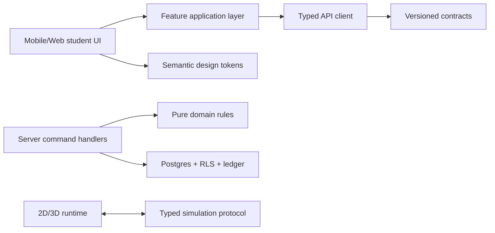

# BioLearn V2 - Đặc tả và phản biện trải nghiệm học viên

- **Roadmap:** V2-A0, chuẩn bị cho V2-A1 đến V2-A4
- **Trạng thái:** hướng sản phẩm cần duyệt trước wireframe/code
- **Nền tảng:** iOS/Android bằng Expo và student web responsive
- **Đối tượng:** học sinh lớp 6-12

## 1. Kết luận thiết kế

Trải nghiệm học viên cần được xây thành năm domain sản phẩm ổn định, thay vì
thêm màn hình vào một file lớn:

1. `Hành trình`: Map theo chương và các ải luyện tập.
2. `Phòng Lab`: thực hành, game 2D và mô phỏng 3D.
3. `Thi đấu`: leaderboard, PvP và quiz live.
4. `Nhiệm vụ`: nhiệm vụ ngày, streak, Trạm Sinh học theo ngày và sự kiện.
5. `Hồ sơ`: thành tựu, avatar, tài liệu/video, thư và cài đặt.

Mobile dùng bottom tabs; desktop dùng navigation rail/sidebar cùng information
architecture. Hai nền tảng dùng chung domain/contracts/API/tokens, nhưng không
cố dùng chung component DOM với React Native.

## 2. Luồng mở ứng dụng và đăng nhập

```text
Cold start
→ Splash có tiến độ trung thực
→ Kiểm tra session/content tối thiểu
→ Auth gateway
→ Chọn Học viên hoặc Giáo viên
→ Đăng nhập
→ Xác nhận role phía server
→ Exit transition ngắn
→ Resume đúng màn hình hoặc Hành trình
```

### Splash

- Splash full-screen dùng logo BioLearn legacy đã kiểm kê và thanh tiến độ ADN
  nằm ngang: hai dải xoắn chuyển động, mầm cây chạy trên dải phía trên, phần trăm
  thật nằm giữa. Chi tiết bắt buộc nằm trong
  `STARTUP_AUTH_DAILY_STATION_VISUAL_SPEC.md`.
- Tiến độ phản ánh các mốc thật như khởi tạo storage, khôi phục session và tải
  manifest; không chạy giả đến 99% rồi chờ vô hạn.
- Nếu startup quá thời gian, hiển thị trạng thái offline/retry thay vì giữ người
  dùng ở animation.
- Warm start không phát lại intro dài; chuyển thẳng đến resume target.

### Auth gateway

- Hai lựa chọn `Học viên` và `Giáo viên` là điểm vào rõ ràng, nhưng backend luôn
  xác minh role; không tin lựa chọn trên client.
- Học viên có Google, email/mật khẩu, đăng ký và quên mật khẩu. Giáo viên có
  form riêng và luồng đăng ký/yêu cầu xác minh; không dùng mã xác minh demo hoặc
  secret hard-code trong client.
- Giao diện kế thừa độ đầu tư cosmic/liquid-glass của login legacy làm tham chiếu
  thị giác, không port code Supabase/role cũ.
- Giáo viên về sau đi đến teacher web; student app không chứa dashboard admin.
- Có password recovery, loading, lỗi mạng, tài khoản khóa và accessibility.

### Chuyển cảnh sau đăng nhập

- Motion 400-700 ms: surface auth co/hoà vào HUD rồi reveal cảnh Hành trình.
- Không chặn navigation bằng animation; có bản reduced-motion là fade ngắn.
- Haptic/sound chỉ phát khi người dùng cho phép và không phát trên web mặc định.

## 3. Chính sách Liquid Glass và theme

Liquid Glass là material cho lớp điều khiển nổi, không phải lớp phủ toàn hệ thống.
Apple nhấn mạnh hierarchy, tính nhất quán, màu điều khiển có chừng mực và nội dung
giữ focus. `liquid-glass-js` chỉ được dùng làm nghiên cứu/prototype vì hiện dựa
trên WebGL + page capture và vẫn liệt kê TypeScript, accessibility, performance,
mobile touch trong roadmap; chưa được chọn làm dependency production.

### Nơi nên dùng glass

- Bottom tab/navigation rail, HUD XP-vàng-kim cương-energy-streak.
- Nút back/close/action nổi, dialog ngắn và control trên simulation.
- Role switch và submit button ở auth khi nền phía sau đủ ổn định.

### Nơi không dùng glass

- Nội dung bài học dài, bảng dữ liệu, toàn bộ background và card lồng card.
- Text quan trọng đặt trực tiếp trên ảnh/biome biến động.
- Quiz answer cần nhận biết nhanh; dùng surface đặc có semantic state rõ.

### Material contract

Mỗi glass surface cần semantic token cho fill, tint, border, blur, shadow, text,
focus và fallback. Có ba cấp `subtle`, `regular`, `prominent`; không cho mỗi
component tự chọn blur/opacity tùy ý.

- Light: “phòng lab ban ngày”, nền trắng ngà/xanh thực vật nhạt, chữ đậm, không
  palette AI sặc sỡ.
- Dark: “galaxy sinh học ban đêm”, xanh đen sâu và phát quang có kiểm soát,
  không neon trên mọi thành phần.
- Nền là scene layer độc lập với feature. Có thể thay ảnh tĩnh/nền động bằng
  manifest mà không đổi layout, auth, progress, ranking, PvP hoặc teacher flow;
  lỗi background phải rơi về fallback chứ không kéo sập màn hình.
- Khi `Reduce Transparency`, hiệu năng thấp hoặc browser không hỗ trợ: thay blur
  bằng surface gần-đặc, giữ viền/độ tương phản.
- Geometry, vùng chạm và ý nghĩa trạng thái không đổi giữa light/dark.
- Kiểm tra WCAG AA, Dynamic Type, bàn phím, screen reader và reduced motion.

Nguồn nghiên cứu:

- Apple Liquid Glass: `https://developer.apple.com/documentation/technologyoverviews/liquid-glass`
- Web prototype: `https://dashersw.github.io/liquid-glass-js/`

## 4. Trạm Sinh học hằng ngày

Trạm Sinh học khác Map học. Đây là hành trình ngắn theo ngày để tạo thói quen,
với bố cục na ná ảnh tham chiếu: tuyến liên tục, các mốc ngày, dấu vị trí, khóa
và tối đa ba sao. **Không chốt việc sao chép tàu hỏa/đường ray**; hình tượng phải
được sáng tạo lại theo Sinh học như quy định trong
`STARTUP_AUTH_DAILY_STATION_VISUAL_SPEC.md`.

### Cấu trúc bắt buộc, hình tượng được sáng tạo lại

- Có tuyến uốn liên tục, biểu tượng hành trình BioLearn ở vị trí hiện tại và các
  biển `Ngày 1`, `Ngày 2`, ... theo thứ tự.
- Mỗi trạm có ba vị trí sao; hoàn thành hoàn hảo là **3 sao**. Trạng thái
  locked/current/completed không chỉ dựa vào màu.
- Tuyến/phương tiện có thể dùng ADN, microtubule, mạch dẫn, sợi nấm, dây leo,
  linh vật hoặc một ý tưởng khám phá Sinh học nguyên bản; không sao chép tàu,
  ray, cây, màu và tỷ lệ từ ảnh.
- `docs/assets/map-journey-visual-reference.png` là ảnh tham chiếu chính cho Trạm
  ngày về bố cục/nhịp, không phải asset hoặc thiết kế cuối.

### Luật đề xuất

- Mỗi ngày server mở một trạm; ngày chưa mở có lý do khóa rõ.
- Một expedition gồm 3-5 hoạt động ngắn, phối hợp kiến thức, quan sát, ghép/sắp
  xếp và mini simulation từ content đã duyệt đúng lớp.
- Hoàn thành hoạt động cuối mở rương; reward policy để cấu hình server và có
  idempotency key, chưa khóa số vàng/kim cương trong UI/code.
- Nếu bỏ ngày, không nên khóa vĩnh viễn nội dung học thuật. Daily station là
  engagement; Map mới là hành trình chương trình chính.
- Admin về sau quản lý template/instance/activity version, không sửa trực tiếp
  nội dung đang active; thay đổi tạo version mới.

### Điểm cần cải tiến so với yêu cầu ban đầu

“Mỗi ngày chỉ đi được một trạm” nên hiểu là **một expedition mới mỗi ngày**, không
ngăn học sinh ôn trạm cũ. Bắt buộc chỉ chơi đúng một lần dễ gây hụt học và tạo
FOMO, đặc biệt với học sinh có lịch học/khả năng tiếp cận thiết bị khác nhau.
Ôn lại không được tự cấp reward lần hai; reward và số sao do server quyết định.

## 5. Map học và cơ chế sửa sai

Map bám đúng lớp, chương, bài và yêu cầu cần đạt. Node có thể là lesson,
challenge, lab, Mini Boss, Boss, 3D hoặc reward. Mỗi attempt chọn 3-5 item theo
blueprint/pool đã publish và seed do server ký để có thể audit.

### Loại activity đầu tiên

- Multiple choice/quiz.
- Matching/nối thuật ngữ.
- Fill in blank với normalization tiếng Việt có kiểm soát.
- Short constructed response/viết từ; không chấm chỉ bằng exact string nếu có
  nhiều cách diễn đạt đúng.
- Ordering, classification và diagram labeling cho nội dung phù hợp.

### Energy và retry

- Energy tối đa 20; câu sai hợp lệ trừ 1 qua command server-authoritative.
- Khi kết thúc attempt, hệ thống tạo `remediation set` chỉ gồm các item hoặc kỹ
  năng chưa đạt; không bắt làm lại toàn bộ ải.
- Câu làm lại không nên luôn giống y hệt đáp án/thứ tự. Dùng biến thể cùng
  learning outcome để tránh học thuộc vị trí; vẫn liên kết với lỗi gốc.
- Ải có trạng thái `completed` và mastery riêng. Sai một câu không nên xóa toàn
  bộ tiến trình đúng; đạt mastery khi remediation set được xử lý.
- Energy không được trở thành paywall học tập. Khi hết energy, vẫn cho xem lý
  thuyết, tài liệu và feedback; chờ/hồi energy chỉ giới hạn attempt có reward.

## 6. Game 2D/3D và mô phỏng thí nghiệm

Không quyết định 2D/3D theo độ “hoành tráng”; chọn theo mục tiêu học tập và thao
tác cần đánh giá.

| Hoạt động | Hướng đầu tiên | Lý do |
|---|---|---|
| Làm sữa chua | 2D/native guided simulation | Cần thứ tự, nhiệt độ/thời gian, an toàn và quan sát |
| Lai Mendel | 2D bảng Punnett/state machine | Cần thay allele, tạo phép lai, phân tích tỉ lệ |
| Xây dựng ADN | 2D drag/snap trước, 3D explore bổ sung | 2D dễ thao tác/chấm; 3D giúp xem cấu trúc |
| Hệ tiêu hóa | WebView 3D typed bridge | Tận dụng model đã có, cần checkpoint/evidence |
| Hành trình oxygen | WebView 3D hoặc 2.5D | Cần tuyến flow, causal steps và performance test |
| ADN/ARN, virus | 3D explore có nhiệm vụ | Không chỉ xoay model; phải có mục tiêu và rubric |
| Protein PDB | Web runtime chuyên biệt | PDB/Mol* không chuyển trực tiếp sang React Native |

Mọi model Cloudinary phải có asset manifest gồm quyền sử dụng, version, checksum,
dung lượng, fallback và performance budget. Có model trên cloud không đồng nghĩa
được phép phát hành hoặc chạy tốt trên điện thoại.

## 7. Nhiệm vụ ngày và streak

Ba nhiệm vụ đề xuất:

1. Hoàn thành một activity/game hợp lệ.
2. Tích lũy 20 phút **active learning** trong ngày.
3. Hoàn thành 5 node/activity đủ điều kiện.

### Active learning thay cho thời gian đăng nhập

Không tính từ lúc tài khoản truy cập vì người dùng có thể để app mở. Server cộng
các phiên active khi app foreground và có heartbeat/interaction hợp lệ; dừng khi
background, idle hoặc mất session. Tổng thời gian được lưu để tiếp tục trong ngày
và reset theo timezone nghiệp vụ ở 00:00.

### Streak

- Chỉ sáng lửa khi cả ba mission hoàn tất; animation có reduced-motion.
- Mốc reward là cấu hình server/versioned, không hard-code. Mẫu 3, 5, 7...30 rồi
  33, 35...60 có thể biểu diễn bằng milestone policy.
- Màu lửa ẩn đỏ → cam → vàng → lục → lam → chàm → tím nên được coi là cosmetic
  tier, nhưng vẫn cần icon/nhãn cho accessibility; không chỉ dựa vào màu.
- Server quyết định ngày/timezone và ghi audit; đồng hồ thiết bị không được chốt.
- “Khôi phục về mốc gần nhất” cần chốt lại: ví dụ mất ở ngày 8 rồi phục hồi 7 có
  thể tạo cảm giác bị phạt hai lần. Đề xuất restore một ngày bị bỏ lỡ để giữ
  current streak, có tối đa 2 token/tháng, expiry rõ và receipt idempotent.
- Không tự động tiêu token. Học sinh được xem preview và xác nhận sử dụng.

## 8. Ranking, PvP và Quiz Live

### Ranking

- Dùng season và score event có nguồn; không xếp hạng trực tiếp theo total XP
  trọn đời vì tạo lợi thế không thể bắt kịp.
- Tách leaderboard học tập theo lớp/khối và leaderboard PvP; có opt-out/ẩn danh
  phù hợp cho học sinh.
- Reward event từ Map, Trạm và mission phải có giới hạn/chống farm.

### PvP

- 1v1 làm trước; 2v2 chỉ sau khi reconnect, synchronization và moderation của
  1v1 đạt gate.
- Chọn khối/lớp; server chọn pool/seed, deadline, đáp án và score.
- Realtime chỉ vận chuyển event. Log append-only cho join, question, answer,
  disconnect, reconnect, result và reward receipt.
- Có rate limit, anti-collusion, report/block, nickname safety và xử lý bỏ trận.

### Quiz Live

- Student join bằng mã/QR, có waiting room, reconnect và trạng thái host rõ.
- Teacher editor học workflow từ Kahoot/Quizizz nhưng UI/brand riêng.
- Câu hỏi là version đã lưu; đáp án đúng không broadcast trước khi khóa câu.
- Cần hỗ trợ media, timer, multiple/single select, ordering, short answer và
  explanation; mở dần theo vertical slice, không làm tất cả ngay.

## 9. Hồ sơ, tài liệu và thư

- Hồ sơ: avatar, tên hiển thị, thành tựu, cosmetic background light/dark và
  quyền riêng tư. Tên/avatar cần moderation phù hợp học sinh.
- Tài liệu/video: metadata, quyền sử dụng, caption/transcript, trạng thái tải và
  download policy. Không bundle nguyên PDF SGK mặc định.
- Cài đặt: music, sound effect, haptics, motion, transparency, theme và data
  download; mỗi lựa chọn có default an toàn.
- Thư: phân biệt system notification, reward gift và message vận hành; có read
  receipt, expiry, claim idempotency và chống gửi lặp.

## 10. Ranh giới module để dễ bảo trì



- Route/layout mỏng; feature sở hữu screen/component/hook/model của chính nó.
- Domain thuần không import React, Expo, DOM hay Supabase SDK.
- Reward/progress/energy/streak/ranking/PvP/publish thuộc server/domain.
- Content nằm trong workflow/versioned data, không hard-code trong UI.
- File lớn được tách theo capability/state machine, không tách thành `utils` chung.

## 11. Thứ tự triển khai đề xuất

1. Hoàn tất `V2-A0`: ADR, inventory, threat model, workflow và wireframe student
   light/dark; duyệt vertical slice học thuật.
2. `V2-A1`: workspace tối thiểu, Expo shell, student web shell, tokens, contracts,
   local Supabase và CI.
3. `V2-A2`: identity, curriculum, journey, attempt/progress, energy/reward ledger.
4. `V2-A3`: một cụm bài end-to-end gồm auth, Map, lesson, lab, Mini Boss,
   remediation và reward trên mobile + student web.
5. `V2-A4`: Trạm ngày, mission/streak, hồ sơ, media và leaderboard.
6. Chỉ sau đó làm Teacher/Admin/Content Studio, Quiz Live và PvP theo gate.

## 12. Quyết định còn cần người dùng duyệt

- Tên hiển thị cuối cùng của “Trạm hằng ngày” và concept Sinh học cuối cùng cho
  tuyến/biểu tượng hành trình; cấu trúc ngày/khóa/ba sao đã được chốt.
- Timezone nghiệp vụ khi học sinh ở nhiều vùng; mặc định có thể dùng
  `Asia/Ho_Chi_Minh` cho pilot tại Việt Nam.
- Energy hồi theo thời gian, nhiệm vụ hay cả hai; giới hạn để không cản việc học.
- Streak restoration giữ current streak hay quay về milestone gần nhất.
- Vertical slice lớp/chương đầu tiên sau khi PDF/YCCĐ được reviewer xác nhận.
- Công thức XP/vàng/kim cương/reward theo từng mode.

Các quyết định chưa chốt phải nằm trong policy/config hoặc ADR, không hard-code.
